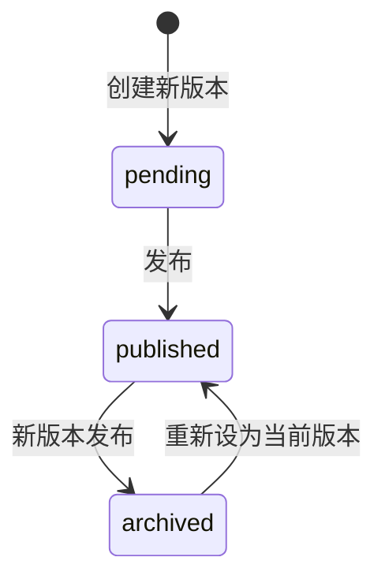

因为某个业务需求所以需要设计一个对于文章的版本管理，既然是版本管理...那是不是可以借鉴一下 `git`？

<!-- more -->

## 参照实现

对于版本化，我们有个相当标准的参考实现：`git`

`git` 对一个 repository 的抽象为：repository 的各个变更为具体的 object，而使用一个版本指针来管理

简单来讲，就是 _thin ref + immutable snapshot_

### Thin Ref

通过 Thin Ref 可以构建一个索引项的历史变更

Thin Ref 是内容的**稳定身份标识**，本身不保存业务数据，只记录：

- 这个内容项是什么时候被创建的
- 是谁创建了它
- 它指向哪些历史快照

它的作用类似于 git 里的 branch/tag，或者文件系统里的 inode。外部引用永远只指向这个 Ref，Ref 下面的具体版本可以任意增减、切换状态，而不会因为版本的更替导致外部链接失效。

### Immutable Snapshot

不可变快照应当是单调递增的——不可变快照的意思是：内容不能发生变化，但是元数据可以。

具体来说：

- **内容字段不可变**：标题、正文、描述、关联资源等一旦写入就不会再被修改
- **元数据可变**：版本的 workflow 状态（`pending`、`published`、`archived`）可以流转

每个 Snapshot 都是一次编辑意图的完整封存。想要修改内容，必须创建一个新的 Snapshot，而不是覆盖旧的。

## 数据模型

因为这个数据模型略微抽象，因此我们引入一个简单的例子使得其更好理解：对于文章的版本化管理

- 第一次保存时，系统为他创建一个**文章身份**（Ref），同时生成第一个**草稿版本**（Snapshot）
- 他继续修改标题和正文，系统不会覆盖旧版本，而是新增第二个 Snapshot
  - 这是这个例子中最重要的行为假设
- 他觉得第二个版本可以发布，于是把它标为 `published`；第一个版本仍保留为 `pending` 或后续可归档
- 过几天他又修改了内容，新增第三个 Snapshot；发布第三个版本时，第二个版本自动降级为 `archived`
- 自始至终，外部链接一直指向最开始创建的那个 Ref ID，不会因为版本切换而失效

这个场景里的两类对象，对应到数据模型就是两张核心表：

| 表                       | 职责               | 关键字段                                                                                                |
| ------------------------ | ------------------ | ------------------------------------------------------------------------------------------------------- |
| `refs` / `listing_refs`  | 稳定身份与历史入口 | `id`, `created_by`, `created_at`                                                                        |
| `snapshots` / `listings` | 不可变的版本内容   | `id`, `ref_id`, `title`, `description`, `content`, `resource_ids`, `changed_by`, `created_at`, `status` |

### Ref 表

Ref 表非常薄，只负责内容的身份。

- `id`：全局唯一，外部系统引用的就是这个 ID
- `created_by` / `created_at`：记录内容项的诞生信息
- 不保存任何业务内容

### Snapshot 表

Snapshot 表保存每一次变更后的完整内容。

- `id`：版本自己的唯一标识
- `ref_id`：属于哪个 Ref
- `title` / `description` / `content` / `resource_ids`：这次版本的完整内容
- `changed_by`：谁创建了这个版本
- `created_at`：版本创建时间
- `status`：当前 workflow 状态

注意：`ref_id` 同一个时刻下只允许存在一个 `published` 版本。新的版本发布时，旧的 `published` 版本会转为 `archived`。

## 版本状态机

每个 Snapshot 都处于以下三种状态之一：

| 状态        | 含义                                                 |
| ----------- | ---------------------------------------------------- |
| `pending`   | 草稿，未发布，仅创建者可见或用于审核                 |
| `published` | 已发布，是当前对外提供的内容                         |
| `archived`  | 已归档，曾经是 `published`，被新版本替换后进入此状态 |

### 状态流转规则

- `pending → published`：审核通过或创建者主动发布
- `published → archived`：当同一个 Ref 下出现新的 `published` 版本时，旧的 `published` 自动降级为 `archived`
- 不直接从 `pending → archived`，也不允许 `published` 回退到 `pending`
- 不允许同一个用户同时存在多个 `pending` 版本，避免草稿堆积和并发冲突

## 读写语义

### 写入

所有写入操作都只会新增 Snapshot，不会修改已有 Snapshot。

- **首次创建**：在 Ref 表中插入一条新记录，同时生成第一个 `pending` 版本的 Snapshot
- **更新内容**：给已有 Ref 新增一个 `pending` 版本的 Snapshot
- **发布版本**：把指定的 `pending` 版本状态改为 `published`，并把该 Ref 下其它 published 版本降级为 `archived`

### 读取

读取时需要明确指定「通过 Ref 找哪个版本」：

- **公开访问**：默认读取 Ref 下最新的 `published` 版本；如果没有 `published` 版本，则视为不存在
- **编辑/管理场景**：可以列出 Ref 下的所有版本，查看 `pending` 或 `archived` 的历史版本
- **按版本读取**：如果直接持有 Snapshot ID，可以读取该 Snapshot 的完整内容

## 不变性保证与并发控制

### 不变性

不变性由两层保证：

1. **业务层约定**：写入后不再修改 Snapshot 的内容字段，所有"修改"都是新增版本
2. **数据库层兜底**：内容字段只有在 INSERT 时写入，UPDATE 只允许修改 `status` 字段；必要时可以用触发器或权限约束限制 UPDATE 的列范围

### 并发控制

- **同一用户单 pending 草稿**：业务层先检查该 Ref 下是否已存在该用户的 `pending` 版本，避免重复创建草稿。数据库层面可加上部分唯一索引作为最终防线
- **发布竞争**：发布版本时，必须保证同一 Ref 下只有一个 `published` 版本。业务层先把旧 `published` 改为 `archived`，再把新的 `pending` 改为 `published`，整个过程放在同一个事务里
- **读取一致性**：读 `published` 版本时，使用 Ref + status 查询；由于 `published` 状态的切换是事务性的，读到的要么是最新的 `published` 版本，要么旧 `published` 已在事务中被降级

> [!NOTE]
>
> 当然，缓存层依然要记得做失效

## 与 git 模型的对照

| git 概念       | 本方案对应            | 说明                               |
| -------------- | --------------------- | ---------------------------------- |
| commit         | Snapshot              | 不可变的内容快照                   |
| branch/tag     | Ref                   | 稳定指针，指向某个当前版本         |
| HEAD           | `published` 版本      | 当前对外生效的内容                 |
| commit history | Snapshot 序列         | 按 `created_at` 排列的历史版本     |
| `git checkout` | 切换 `published` 版本 | 可以重新指定哪个版本是 `published` |

本方案和 git 的核心思想一致：用不可变对象保证历史可追溯，用薄指针保证外部引用的稳定性。

## 设计收益

- **历史可追溯**：每次修改都留下完整记录，可以回查任意时刻的内容
- **回滚简单**：重新把一个 `archived` 版本标回 `published` 即可恢复旧内容
- **外部链接稳定**：外部引用只依赖 Ref ID，不会因为内容更新而失效
- **审核友好**：`pending` 版本天然支持"先编辑、后发布"的工作流
- **并发安全**：发布与草稿创建都有明确的事务边界，避免状态混乱

并且根据状态转换机制的设置，可以使用数据库作为最底层的约束来实现兜底，这样就可以畅快地无畏并发了
