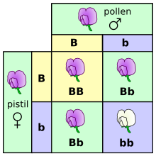

> [!NOTE]
>
> 因为最近要实现这方面的功能，所以写篇文章复习一下。

<!-- more -->

## 遗传学三大定律

在深入探讨遗传学的代码实现之前，需要清楚遗传学的三大定律

### 基因分离定律（孟德尔第一定律）

基因作为遗传单位在体细胞中是成双的，它在遗传上具有高度的独立性。

因此，在减数分裂的配子形成过程中，成对的基因在杂种细胞中能够彼此互不干扰，独立分离，通过基因重组在子代继续表现各自的作用。

这一规律从理论上说明了生物界由于杂交和分离所出现的变异的普遍性。

### 基因自由组合定律（孟德尔第二定律）

一对染色体上的等位基因与另一对染色体上的等位基因的分离或组合是彼此间互不干扰的，各自独立地分配到配子中去。

### 基因的连锁和交换定律

一般而言，两对等位基因相距越远，发生交换的机会越大，即交换率越高；反之，相距越近，交换率越低。因此，交换率可用来反映同一染色体上两个基因之间的相对距离

以基因重组率为 1% 时两个基因间的距离记作 1 **_厘摩_**（$$centimorgan, cM$$）

## 代码实现

TODO
