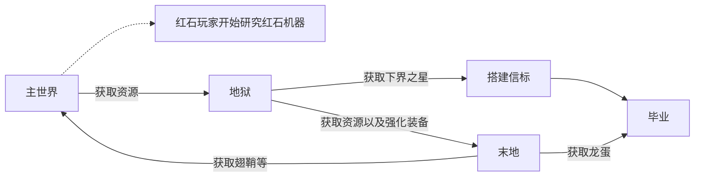
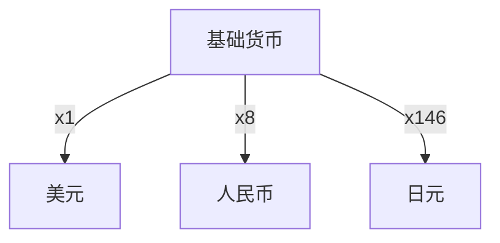
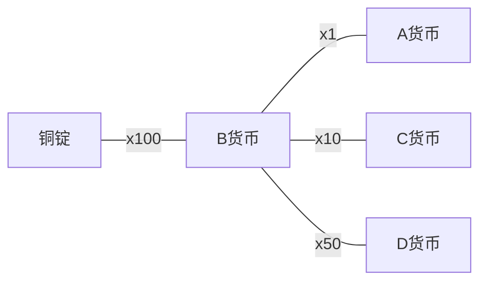

如何在 Minecraft 设计经济系统是一个服务器维护人员以及策划组持久讨论的问题，那么过了这么多年我能给出什么方案？

<!-- more -->

## 经济系统基础

首先需要了解经济系统的一般特性，在了解经济系统的一般特性后我们可以以此为理论基础进一步设计原始的经济系统[^0]

> (1)经济系统的整体性。经济系统是由相互联系和相互作用的若干经济元素结合而成的有机整体。各个经济元素与经济系统之间的关系是整体和部分的关系。各经济元素在功能上必须与经济系统整体适应，居于经济系统整体的从属地位。正是由于系统局部的统一性，才构成了系统的整体性。所以，我们在处理任何经济系统问题时，应坚持从经济系统的整体出发，从全局出发，发挥经济系统整体的特定功能和效益。
>
> (2)经济系统的层次性。局部的独立性构成系统的层次性。经济系统的层次，指经济系统中各经济元素之间的地位、等级关系。它反映了经济系统是可以组合的，也是可以分解的。经济系统的各个组成部分既可以自成系统，又可以互为系统。不同层次或同一层次的经济元素既有共同的运行规律，又有各自的运行规律。经济系统的层次及其层次之间的关系说明经济系统具有多层次性。
>
> (3)经济系统的结构性。经济系统的结构，指经济系统内部各个经济元素之间的相互联系和相互作用的结合形式。它反映了经济系统中各经济元素之间的比例关系、排列顺序和结合方式。合理的经济结构，能使经济系统具有生命力，更加协调地运行。一般来讲，经济系统结构具有相对的稳定性。对不合理的经济系统结构要进行调整，保持经济系统的合理运行。总之，经济系统的结构是否合理，关系到社会经济发展的战略问题，关系到经济系统特定功能与效益的发挥和提高问题。
>
> (4)经济系统的开放性。开放性是针对封闭性而言的。开放系统是与其他系统进行物质、能量、信息交换的系统。自然界中存在的一切系统，几乎都是开放系统。完全与外界隔绝的孤立系统实际上并不存在。经济系统的开放性，指经济系统与物质、能量、信息等的相互关系。如果一个经济系统开放性很强，说明它与环境交换的物质、能量、信息的数量大，范围广泛，种类繁多。开放的经济系统既受到国内自然条件、生态环境、资源数量等自然环境的制约，又受到人口状况、经济体制和政策等社会经济环境的影响。所以，够开放的中国保持经济系统的开放性，非常必要。

有了最原始的理论基础，接下来我们来细细分析这些理论基础能导出什么。

### 经济系统的整体性

#### 什么叫做有机的整体？

> 经济系统是由相互联系和相互作用的若干经济元素结合而成的有机整体

经济系统是一个巨系统，一个系统是由多个不同的部分组成，而巨系统是由多个不同的系统组成。

什么是经济元素？元素就是构成新个体的基础要素，这里的定义为：信息、物质、能量、时间、空间[^1]或个人、企业、政府、市场、资源[^2]。

它们之间互相协调互相影响，最终到达一个稳定的点，成为一个有机系统。

比如：当一个物件使用原始的工艺需要*大量的时间*与*大量物质*去生产，改良后的工艺在生产该物件时可以*大幅度缩减该物件的时间要素与物质要素*，但我们需要投入更多的物质与时间到*改进工艺*这个步骤，因此在这一个生产流程之中产生了一个平衡：投入时间与物质到改进工艺，但生产物件所需要的时间与物质减少。

由于例子内的元素需求达到了一种有机平衡，从整条生产过程来看最终的结果是导致该物件的成本会被稀释，该物件若需求不变的情况下经济价值会变低。正是因为各个局部经济元素之间有一定程度的统一性和协调性，才会使得经济系统体现出一定的整体性。

> 我们在处理任何经济系统问题时，应坚持从经济系统的整体出发，从全局出发，发挥经济系统整体的特定功能和效益

这句话定义了一个分析任何经济系统问题的方法论，我们应该始终从整体角度出发，考虑全局因素，才能确保经济系统的稳定发展。

#### 举个例子

举个比较现实的例子，这种方法论也适合分析任何巨系统面临的问题。

> 想象一个城市的交通系统作为一个例子。
>
> 在城市交通系统中，各种交通方式（汽车、公共交通、自行车等）构成了交通系统的各个经济元素。每种交通方式都有其特定的功能和效益，但它们需要与整个交通系统相适应，以确保城市内的流动性和效率。
>
> 各个交通方式之间的关系体现了整体和部分之间的关系。例如，交通信号灯、道路规划、公交车站等都是整个交通系统的一部分，它们的协调和协作对于整个系统的正常运行至关重要。
>
> 每种交通方式在功能上需要与整个交通系统整体适应。例如，公共交通系统需要根据人口分布和需求来安排线路，以满足市民的出行需求。同时，道路规划也需要考虑各种交通方式的流量，以保证交通的顺畅。
>
> 整个交通系统的整体性在于，各种交通方式共同构成了一个互相依赖的有机结构，城市的交通运行取决于这些交通方式的协调和平衡。如果某种交通方式出现问题，可能会影响整个系统的效率，导致交通拥堵等问题。

从整体的方向（交通系统）分析了设计交通红绿灯、公交等局部系统的设计，最终达到解决问题的目标。

但是与此同时，一个系统瘫痪会影响到整体巨系统的效率，表现为交通拥堵。

### 经济系统的层次性

#### 理解层次性

这非常容易理解，最典型的为供应链，一种常见但是算比较复杂的经济系统。

接下来我把一个供应链的简化结构按照层次从第一层次到最终层次列举出来。

- 原材料供应商：整个系统的基础，**影响着上下游的产物基础价格**。
- 制造商：它们会把原料组装成为最终的成品，它们的工艺以及运营和决策**决定了了产品的质量和整条供应链的可靠性**。
- 分销商与批发商：库存端，它们可以决定产品的管理和所有订单的的履行，**决定了供应链的灵活性以及效率**。
- 零售商：将产品推向市场，使其成为商品。从消费者收集信息（例如需求）反馈给上游，**决定了整个供应链的规划**。
- 消费者：最终消费端，是整个供应链的动力来源，**供应链到底生产什么以及生产多少**和他们的需求有关。

#### 什么叫做每个层次也可以独立？

我们把"原料供应商"这一层次单独取出来解释，为什么*各个组成部分既可以自成系统，又可以互为系统*。

原料供应商中依然存在供应链关系：原料供应商从原料生产者获取原料，最终加工成为初级材料。

典型的例子为乳业，在奶产品供应链中有奶农，奶厂，消费者。

原材料供应商由奶农和收购方构成，那么问题来了，他们能不能构成独立的系统？答案是可以！

奶农自己生产牛奶，自己喝掉，**自己既是原材料供应商，也是消费者**。
也可以自己生产牛奶，送给朋友喝，**自己是原材料供应商，朋友是消费者**。

这只是个"原材料供应商"角度的例子，甚至消费端也是成立的：你把你买到的物品送给朋友，**只要有输入**就能让系统运行下去。

### 经济系统的结构性

像是现实生活中的结构一样，结构是有稳定性，更是具有组成部分的。

#### 为什么经济系统需要一定的结构性？

经济系统需要一定的结构性，如果生产端一直生产没有消费这是可能的吗？这很明显是不可能的，生产端需要需求才能确定生产量，这样生产端迟早会因为产品无法被消费而损毁。

再比如，一个国家不可以只有制造业生产部门，这样的结构单一性过重，容易受到其他国家的冲击。而产业结构会影响经济结构：全是服务部门，会导致只能在服务端消费循环。

我将会以一个国家典型的经济结构解释。

#### 理解为什么一个国家经济结构不能过于单一

一个国家往往包含以下结构

- 家庭（家庭部门）： 家庭在经济结构中占据重要地位，因为它们提供劳动力、消费品的需求以及储蓄。家庭部门通过劳动力市场提供劳动力，通过商品市场提供需求，同时也可能从金融市场获取收入。
- 企业（企业部门）： 企业在经济结构中是生产者，它们生产商品和提供服务。企业通过商品市场向家庭和其他企业销售产品，通过劳动力市场雇佣劳动力，通过金融市场筹集资金。
- 政府（政府部门）： 政府在经济结构中扮演多重角色，包括提供公共服务、征税、开支以及监管。政府通过金融市场筹集资金，通过政策影响其他部门的活动。
- 金融市场： 金融市场是各个部门进行资金交流的场所。家庭、企业和政府都可以在金融市场融资或投资，从而影响整体的经济活动。
- 商品市场： 商品市场是各个部门交换物品和服务的地方。家庭购买消费品，企业之间交换原材料和产品，这些交换构成了商品市场的一部分。

如果一个国家彻底抹除了商品市场，那么这部分的结构往往需要由政府来承担，一个角色承担了过多的职能会导致不稳定：因为受到自身的影响过多，**一旦政府停摆对应的商品市场也会停摆**，造成消费品与商品无法交流，企业之间也无法交换原材料完成生产职能，典型的例子是前苏联与朝鲜。

如果一个国家抹除了企业，那么将会由市场（金融与商品）承担这部分职能：**消费品将会完全依赖进口**，本国（本经济体）不再具有生产能力，典型的例子是马达加斯加。

### 经济系统的开放性

一个经济系统，只有生产没有其他经济系统的输入，现实吗？

一个经济系统，只有生产没有向其他经济系统输出，现实吗？

其实可以，叫做小农经济。

这种经济在没有外来干扰的情况下非常稳定，但是发展极其缓慢：因为无法提高生产力。

如果一个经济体有原材料输入，那么这个经济体可以提高生产力而不降低本国原材料端获取效率，生产出的产品（消费品）可以供国内消费，同时过多的可以输出到国外与其他经济体交换。

这就是为什么开放的经济系统更加具有生命力：**它们更符合互通有无的特性**。

## 剖析 Minecraft

有了基础理论，我们可以开始剖析 Minecraft 和考虑实行的可行性了。

以下的考虑均基于 Vanilla Minecraft，而不是任何的 Modded Minecraft。

### Vanilla Minecraft 里有什么？玩家扮演了什么？

玩家在游戏内可以承担多种角色：生产者，消费者，甚至是零售商。

每个玩家都可以是一个独立的系统：他们可以不去购买资源，完完全全自己获取资源。

最原始的资源为服务器地图中所能产生的资源：所有方块，所有奖励箱内的东西，所有玩家能获取到的物资。

玩家在初期则全部为资源获取者，他们都需要获取最原始的资源。

中期玩家是资源消费端，玩家需要不断的消耗资源，或者转换资源成为其他更少获得的资源。

在末期玩家会不断的出售自己的资源，将自己的资源出售转换成为虚拟货币，以备不时之需。

我们需要重新规划玩家的游戏历程，甚至破坏 Vanilla Minecraft 的游戏历程，让玩家不能快速地到达末期。

### 分析游戏历程，以及分析玩家的扮演阶段

在 Vanilla Minecraft，一个典型的流程为

也就是说当玩家成功搭建完毕信标，或者获取到龙蛋，这个游戏的历程就结束了，玩家选择不再上线等等。

除此之外，玩家玩到无聊了就自然不上线了，这也是一种特例，因为是服务器本身的活力不足导致的问题，这种情况下应该鼓励玩家邀请朋友一起游玩，以及适当的福利以及适当的活动。（除了每日上线以及一些日常活动）

当然，红石玩家是特例，红石玩家不会有毕业的时候，并且是最大的资源生产大头以及消费大头。这部分玩家我们暂时不讨论，因为情况特殊。但是我们需要考虑一些特别的机制：刷怪塔等让某种资源获取效率发生极大变化的结构以及机制。

### 结论

我们现在清楚了，服务器的资源情况取决于玩家当前进入了什么阶段，玩家进入了什么阶段也会影响该玩家在服务器的活跃程度。

还要考虑玩家之间交换物品的方式，因为原始的以物易物也是经济的一部分。

我们需要考虑的地方：

- 玩家的游戏历程以及阶段
- 物品应该如何在玩家之间流通
- 物品的价值如何界定
- 稳定货币应该是什么
- 货币系统如何运作

## 货币系统基础

由于 Vanilla Minecraft 的经济系统为闭环系统，在不存在“无限收购”的前提下，玩家持有的货币始终等于“信用体系”总的货币，也就是所有玩家的资产加起来等于服务器总的资产，服务器需要负责承担“发行者”的角色——服务器货币的总量，取决于服务器愿意发行多少货币给玩家。

### 通货膨胀？通货紧缩？

这是两个很重要的经济学现象，由于表达货币和需求之间的关系。

通货膨胀具体表现为货币贬值，但是货币贬值与通货膨胀实际为两种领域的现象，只是它们之间有相互的关联性。

用人话来讲，就是物价上升，人们的购买力减少。而通货紧缩则相反，物价下跌人们的购买力提升。

那么为什么会产生这两种现象？

当流入市场的货币总量变多，货物的供给没有变或者降低时则会造成通货膨胀。

当流入货币的市场的总量变少，货物的供给没有变或者便多则会造成通货紧缩。

这是两种完全无法避免的经济现象，但是在经济学上一般认为微量的通货膨胀是可以容忍的——因为这可以让一些价格，比如薪资和一些难以改变的物价可以重新定价。而通货紧缩则没有类似的功能，持续的通货紧缩将会造成生产端的破产以及经济衰退。

因此我们暂时认为，我们在设计整个经济系统需要保持整个经济系统呈现出微量通货膨胀的状态。

### 基础货币

基础货币($Base\ Currency$，后文称之为 $B$ 货币)也称之为高能货币，这种货币投入到市场可以成倍扩增货币——举个例子，假如 $A$ 货币与基础货币的价值比值为 100:1，那么向市场内投入 1 基础货币相当于增加了 100 枚 $A$ 货币。

这种货币一般不直接使用，而是替换为流通货币($Currency\ In\ Circulation$)。

我们现在已经明白了基础货币 $B$ 和流通货币 $A$ 的关系实际上等于 $A = nB$ , $n$ 为货币倍率。

那么基础货币总量怎么计算？基础货币总量可以用一个非常简单但是可以变得非常复杂的式子来表示。

$$
中央银行资产A1 + 中央银行负债A2 \approx 基础货币总量
$$

由此我们可以大致估算基础货币到底有多少。对于一个简单的经济系统而言，我们就单纯认为服务器内基础货币总量计算方法为如下

$$
玩家总资产A1 \approx 基础货币总量
$$

### 流通货币

流通货币( $Currency\ In\ Circulation$ )为最终投放到市场里的货币，与基础货币之间存有一定的比值。

我们可以用下面这样的示意图来表达基础货币和流通货币的关系

考虑到 Vanilla Minecraft 的系统，就算是使用 Plug-in Vanilla Minecraft (eg. Spigot) 也大多数使用一种流通货币，那么我们现在就简单的认为流通货币和基础货币比例为 1:1

### 微量的通货膨胀

我们前面提到了，我们先假设每天的市场需求是不变的，那我们可以控制投放到市场中的货币，投放到市场中的货币多了我们的通货膨胀目标就实现了。

当然，前提是我们需要假设每天的市场需求是固定的，增加玩家的购买力，那玩家就有更多的钱去购买物品，供应商自然会给物品涨价，实现微量的通货膨胀。

那我们怎么实现投放到市场中的货币？答案是：每天上线就给玩家发钱。

非常简单粗暴的方法，那还有没有其他的？有，银行利率就是宏观调控通货膨胀的一部分。

但是这种方法需要额外设计银行系统，太复杂了我们就不探讨了吧 XD（目移

我们就简单的认为每天给玩家发钱就是控制通货膨胀的一部分就好了。

### 税收

税收也是经济活动中重要的组成部分，税收可以有效抑制*需求拉动型的通货膨胀*[^3]。

我们在这里探讨一下所得税，让后文的逻辑更加通顺，提供一种抑制通货膨胀的思路。

#### 需求拉动型的通货膨胀

先解释一下什么叫做*需求拉动型的通货膨胀*。

假设全部的玩家都在开荒初期，那么势必会产生一种情况：物品全部价格起飞，因为这个时候需求极大，售卖方可以狠狠地捞一笔，最终导致了需求拉动型的通货膨胀。

然后？然后因为太贵了，没人买，需求回落，价格骤降，变成没人卖，玩家有钱花不出去，产生通货紧缩。

这种一种很自然的经济周期，但是有些逆周期的经济行为，不过我们不探讨。

#### 如何应对

那就是宏观调控，有两种方案。

方案 1: 向市场中投放足够多的平价货物，满足购买方的实际需求

方案 2: 对购买方征收所得税，降低购买方的意愿，进而延缓通货膨胀的速度。

不过我们需要知道的是，第二种方案实际上并不会解决通货膨胀的问题，它可以让通货膨胀变得足够缓慢，形成菲利普斯曲线[^4]。

在本节内容我们讨论第二种方案，现实生活中往往是两种方案混用。

我们在购买物品的时候会产生所得税，纳税人是购买方，当对于这种物品税收过重时我们对这种物品的需求就会降低，因为实际上太贵了，商家也没赚到多少钱。

那这样看，不是他会通货紧缩吗？说好的通货膨胀呢？因为往往我们不会设置太高的税收，我们的最终目的是防止这种物品导致过快的通货膨胀。

我想买的东西是必需品，即使是它税很重，我也会去购买。

商家在短时间内会意识到市场的需求上升，因为很多玩家都需要，所以会涨价（增加供给）。

但是买方因为税收不会多买，会以后再买（需求降低）。

在这时就产生了通货膨胀，但是与此同时玩家的需求是被压制的。

商家在买方需求降低后慢慢减少上架的货物（减少供给）。

在渡过高需求的阶段后可以适当降低税收，玩家的需求会上升（需求上升）。

由此完成了整个经济周期，并且结果税收的调控后通货膨胀显得比较平稳不至于货价高速膨胀。

但是这种通货膨胀是**健康**的，只要它经过**调控**。

从长远来看，市场是有自我调控能力的，即使是不设置税收他也能自己调节。

但是从长远看，到底多长远？所以我们**基于市场需要一定的干预的前提**认为税收是有必要的。

## 动手设计

我们简单地探讨了一下一个经济系统需要什么东西，那么我们开始收集一个经济系统需要什么部分吧！

由以上的探讨我们可以以一个极其原始的观点开始构建一个比较简单的经济系统。

- 基础货币 $Base\ Currency$
- 流通货币 $Currency\ In\ Circulation$
- 基础货币与流通货币的换算关系
- 基础货币的具体表现形式
- 玩家间货币的流转
- 官方市场，用于提供官方控制物价的市场
- 物品的定价规则
- 税收，以及税收后的去向
- 通货膨胀的形式

### 货币系统

作为一个货币系统，首先我们需要一个基础货币，我们叫他 $B$ 货币吧！

$B$ 货币作为世界通用货币，但是不在任何经济体系中流通，因为它不是**流通货币**。

为了我们设计方便，我们就额外设计一个 $A$ 货币，其和 $B$ 货币兑换的比值为 $1:1$

我们需要一种物品来描述 $B$ 货币，那么挑选一个合适的物品吧！这种物品没有太多用途，玩家甚至不想要。那就...暂定成铜锭吧，我们让这种物品从世界上彻底消失，无法获取也不参与任何合成表。

它和 $B$ 货币比值为 $1:100$，也就是 1 个铜锭实际上等于 100 个 $B$ 货币

用以下示意图表示

### 市场

涉及到市场，必定分为由管理员设立的市场以及玩家互相之间的市场，在这里我们只讨论管理员设立的市场，玩家之间设立的市场我们称之为"黑市"，管理员设立的市场称之为"白市"

白市需要确定哪些物品可以在此出售，因为市场需要一定的管控，并且需要设置最低的物价。

在最低的物价之上允许玩家自由定价，并且需要管理员对物价进行管理，防止玩家对物价进行恶意炒作，产生垄断现象。

对于黑市，也就是玩家之间的自由市场，白市应当与黑市正面竞争，在可以的情况下需要和黑市拼比同等物品的价格，并且白市应当尽可能的扩充自己可以出售的物品。

于是我们面对新的问题：物品定价

#### 物品定价

对于物品定价，需要遵守一定的规律：

- 若是稀有物品：考虑从稀有程度下手，不可再生并且无功能的的稀有物品应当禁止出售，并且尽可能压低该物品的价值
- 若是资源物品：考虑从丰度下手，比如矿石等。再考虑获取的时间成本，这种物品应当鼓励玩家出售
- 若是功能物品：考虑从获取难易度下手，比如附魔书。该物品定价需要一定的技巧，需要考虑获取难度以及物品的功能性

#### 物品定价：资源物品

我们以矿石为例，一个矿石产物的定价可以以以下的函数为计算方式

$$
价格P0=基础价格P1+劳动成本B*\sqrt{矿石丰度A}*资源系数X \\
$$

$$
矿石丰度A=区块生成期望Y
$$

$$
劳动成本B=平均获取时间T
$$

资源系数为社区需求程度，我们假设这是个固定值，实际上这个系数可以非常地动态。

考虑钻石的情况，我们令物品的基础售价为$P1=100$，$B=T=600s*1$，$A=3$，$X=100$

那我们的式子就变成了这样：

$$
P0=100+600*\sqrt{3}*100 \approx 100+600*1*100=60100
$$

一个钻石的价格就是 $P0=60100$ 了。

当然，这个式子非常粗糙，一定要重新设计，一定要重新设计，一定要重新设计，重要的话要说三次。

### 税收设计

对于服务器而言，不想要考虑税收收上来的税用于做什么——哪怕是退税都不需要考虑。

所以我们可以简单的认为税收就是为了有效抑制需求拉动型通货膨胀的手段，并且用于回收市场的金币。

税收是一种有效抑制需求拉动型通货膨胀的方案，但是这部分的操作是需要动态的——当需要通过税收抑制需求拉动型通货膨胀时，税收过低，导致税收没有起到抑制通货膨胀的作用；当不需要税收抑制需求拉动型通货膨胀时，过重的税收会导致通货紧缩，过大地抑制市场需求。

我们简单地认为价格为 $ST$ 的物品购买时产生的所得税税率为 $TA\%$，那么玩家实际上需要使用 $ST*(1+TA)\%$ 流通货币来购买，那么税收则为 $T=ST*TA\%$，本次交易中从市场里消失的货币为 $T$。

当日从市场里消失的货币则为

$$
D=\sum_{i=1}^{n}T_{i}，n=当日市场交易次数
$$

但是，对于税收我们依然是需要去统计的——因为税收收上来的税不再有用途，但是会实实在在地减少市场中的金币，会导致通货紧缩，所以若需要保证经济系统微量通货膨胀，这部分减少的金币需要以另外一种方式还给玩家。

### 通货膨胀

我们假设需要保证经济是微量通膨的，那么我们需要考虑到一个问题：不再活跃的玩家是否可以认为是市场流通货币的持有者？

因为如果一个玩家不再活跃了，相当于这个玩家以及这个玩家所持有的货币彻底从市场里消失了，这部分货币属于暂时蒸发状态，所以我们暂时认为这部分的玩家的货币已经不存在了，或者我们认为这部分玩家的货币自从某天突然从市场里**消失**了即可。

我们简单的认为我们地目的就是让市场里的钱以一定的比例变多，那么我们可以以以下的式子来进行计算。

$$
I=\frac{当日投入到市场中的货币B-过去一天市场里减少的流通货币A}{活跃货币总量C}
$$

其中 $A$ 包含了过去一天的总税收 $T$，过去一天被判定为不活跃玩家的财产 $F$，那么可以得到如下式子

$$
A=过去一天的总税收T+过去一天被判定为不活跃玩家的财产F
$$

那我们如何将 $B$ 投入到市场当中？答案是每日上线附送的金币。

考虑到存在玩家赎回财产，那么 $A$ 是有可能为负的，而我们要计算的 $B$ 会因此变成负数，反而从玩家包里扣钱，这显然是不可能的。

因此若 $B$ 小于 0 时，服务器不会发放当日的金币福利（或者仅仅保留基础福利）。

我们可以导出如下计算式子。

$$
B=I*C+(T+F)
$$

所以我们每日发给玩家的货币就变成了如下计算式。

$$
PB=\frac{B}{n}，n=活跃玩家总数
$$

总量为$PB$的货币会在玩家上线时发给玩家。但我们不需要保证每天的任务都是达标的，如果我们需要保证每天的任务达标的话我们可以考虑直接加算到玩家的钱包里。

## 收尾

其实给 Vanilla Minecraft 设计经济系统总是一个不合适的想法，因为 Vanilla Minecraft 的资源实际上是无限的，几乎所有生产资料都是拿在玩家手上的，某种意义上是共产社会。

但是总是有很多玩家和维护人员乐此不疲地给他设计新的内容，即使是 Mojang 开始教玩家玩游戏，玩家也不会放弃实现他们的想法，或许这就是这个游戏即使是现在也依然生机勃勃的原因吧。

用一句很真实的话为我们的原始经济系统设计探讨之路画上句号吧。


从长远来看，我们都死了。


不去做，怎么会知道他到底怎样？从长远来看，那又如何？

## 叠甲

- 笔者不是经济方面专业的学生，对于这部分的设计和想法是基于自己长期的经验积累以及阅读获取导出的。
- 如有不恰当的地方，还请斧正。

<!-- 引用 -->

[^0]: [MBA 智库：经济系统](https://wiki.mbalib.com/wiki/%E7%BB%8F%E6%B5%8E%E7%B3%BB%E7%BB%9F)

[^1]: 这部分是微观经济元素，定义并不是很明确，只能暂时这么定义，并且这么定义是符合上下文的关系的。

[^2]: 这里是宏观的经济元素，定义较为明确，但不唯一。

[^3]: [MBA 智库: 需求拉升型通货膨胀](https://wiki.mbalib.com/wiki/%E9%9C%80%E6%B1%82%E6%8B%89%E5%8A%A8%E5%9E%8B%E9%80%9A%E8%B4%A7%E8%86%A8%E8%83%80)

[^4]: [MBA 智库: 菲利普斯曲线](https://wiki.mbalib.com/wiki/%E8%8F%B2%E5%88%A9%E6%99%AE%E6%96%AF%E6%9B%B2%E7%BA%BF)
