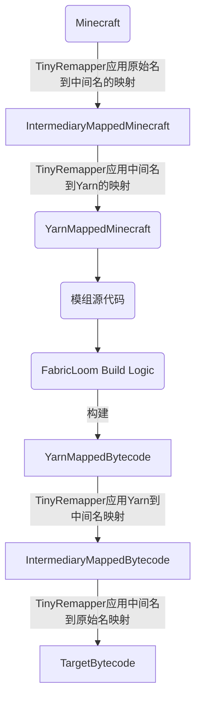

记录一下探索 TinyRemapper 和 FabricMC 构建流程

<!-- more -->

## TinyRemapper 是什么

这是一个隶属于 FabricMC 的构建流水线(_Build Pipelines_)的一部分，TinyRemapper 可以对 JAR 应用 `Tiny` 映射格式(_Remapping format_)。


映射，顾名思义就是把一个东西等价称为另外一个东西。

关于为什么会有这个东西，是因为开发商对 JAR 构建结果应用保护措施而产生，在本文不再赘述。


在应用完毕后，我就可以让名为 `A` 的函数名可以称之为 `getBlock` ，**这对反混淆来讲非常重要，而这是反混淆的最基础能力**。

## FabricMC Build Pipelines：FabricMC 构建流水线

在这一部分需要单独提出，这对于理解 TinyRemapper 的功能与作用非常重要。



可以看出 TinyRemapper 负责的部分是把我们可读的代码重新映射成 JVM 虚拟机内执行需要的代码，或者帮我们把我们读不懂的代码重新映射成我们能读懂的代码。

在 JVM 程序执行机制里，我们运行的 Minecraft 程序是使用原始名，这对我们来讲是几乎不可读的。Yarn 提供了一套标准的、自由的名称，让我们的体验更加顺畅。如果我们在模组里面调用了 Minecraft 的某个函数，对于 JVM 而言是 `INVOKE*` 命令[^0] ，而这些命令的参数其实是 Minecraft 的原始名，比如 `aabb/26390` 。

但是我们其实不会这样写，我们写的通常是类似 `world.getBlock` 这样的代码。

在完成编译后，JVM 居然能应用正确的参数。

这其中发生了什么？

### 反混淆

顾名思义，反混淆就是把混沌的东西变成我们可以读懂的玩意儿

首先我们需要清楚，Mojang 在最早是不给我们提供资料的，我们只有猜。并且不是因为 Minecraft 才出现的反混淆，这是自 JVM 与 Java 诞生之初推广成功后便产生的东西。

在我们猜到这个非常混沌的方法名 `26390` 的大概作用后，我们就可以给他一个有意义的名字，并且记录下来。

记录下来后，映射便诞生了。

### 重映射（重混淆）

我们使用一些手段对字节码应用映射，这样我们就能顺利的写出 `world.getBlock` 这样的代码了，而不需要和 `abjxc1.asobb` 这样诡异的东西作斗争。

可是问题来了，我们前面说了，实际上这样做字节码指令的参数是不对的，是 `world/getBlock` ，JVM 是找不到 ClassPath 的——因为根本没有这个东西。

我们需要使用一个工具，用一种手段，和反混淆相反的手段，来纠正这些 ClassPath 和字节码指令参数，不如就叫做...**重映射**吧！

在经过这个流程后，我们的代码编译出来的模组终于可以被 JVM 正常加载，以及正常加载调用 Minecraft 的函数了。

### 中间名的诞生

在经过长期的经验中我们发现了一个大问题——他奶奶的，Mojang 一张混淆表给他妈的用的天荒地老[^1]。

而且两个版本之间经常一堆代码不变，那我是不是只用在意两个版本之间的新增和减少？

不对啊，聪明点的人肯定能想到这个玩意儿，而且早就在搞了。

确实是这样，并且 Yarn，MCP，Spigot 更新流程都是这样的。

问题是假如，我的意思是假如，假如我 Minecraft 的两个版本更新过快，你没时间反应，阁下又当如何应对？

又比如说，我需要编译前扫描整个 Minecraft 的字节码提取有用的信息，那编译可真的太慢了。

那我干脆直接早点提出来，要用的时候直接加载，快不快？非常快。

我假如说，我想 Mojmap 和 Yarn 混用，阁下又当如何应对？

没错，我会做一个转接层，而 Minecraft 反混淆后的各种方法名，字段名，类名，就叫做**中间名**！

然后我一视同仁，我把依赖的模组，全部用中间名转换成我想用的映射名，非常完美。

## 理解 Tiny 格式

TinyRemapper 有它们自己的格式，这是这个笔记的重点

这篇笔记以 1.19.4 的 [tiny 文件](https://raw.githubusercontent.com/FabricMC/intermediary/master/mappings/1.19.4.tiny)为例

第一行可以直接忽略，我们称之为 `TinyRemapper Metadata`

从第二行开始，就全是我们的主角了。

从分析角度来看，整个 tiny 文件格式应该以行为分析单位，因此我们也会以行作为例子来分析。

同时我也会用 Rust 代码来表达应有的储存结构，使用 TinyRemapper 的解析逻辑作为分析依据。

### CLASS

```txt
CLASS    a    net/minecraft/class_4581
│───│   │─│   │──────────────────────│
  │      │             │
  │      │             │
  │      │             │
  │      │             └──────── 完全限定名
  │      └────────────────────── 归属文件（混淆名）
  └───────────────────────────── `CLASS` 类型描述
```

对于这行的解析，我会把他用 Rust 代码表述为

```rust
struct Class {
    obf_name: String,
    intermediary_name: String,
}
```

对应的 Java 代码为[这里](https://github.com/FabricMC/tiny-remapper/blob/fa0c4e72f6ce434e91b0adbcc82a9b021eed6cc3/src/main/java/net/fabricmc/tinyremapper/TinyUtils.java#L234-L237)

```java
if ("CLASS".equals(type)) {
    out.acceptClass(splitLine[1 + fromIndex], splitLine[1 + toIndex]);
    if (obfFrom != null && !splitLine[1 + fromIndex].isEmpty()) obfFrom.put(splitLine[1], splitLine[1 + fromIndex]);
}
```

### FIELD

```txt
FIELD    b    F    a    field_21633
│───│   │─│  │─│  │─│   │─────────│
  │      │    │    │         │
  │      │    │    │         └── 中间名
  │      │    │    └──────────── 混淆名
  │      │    └───────────────── 类型方法描述符
  │      └────────────────────── 归属文件
  └───────────────────────────── `FIELD` 类型描述
```

```rust
struct Field {
    class: String,
    type_desc: String,
    obf_name: String,
    intermediary_name: String,
}
```

### METHOD

```txt
METHOD    a    (F)Lorg/joml/Quaternionf;    a    method_46349
│────│   │─│   │───────────────────────│   │─│   │──────────│
  │       │                 │               │          │
  │       │                 │               │          └ 中间名
  │       │                 │               └─────────── 混淆名
  │       │                 └─────────────────────────── 返回值方法描述符
  │       └───────────────────────────────────────────── 归属文件
  └───────────────────────────────────────────────────── `METHOD` 类型描述
```

METHOD 和 FIELD 的处理逻辑是是一样的，所以直接看 `CLASS` 描述类型的代码就行。

对应的 Rust 代码为

```rust
struct Method {
    class: String,
    return_desc: String,
    obf_name: String,
    intermediary_name: String,
}
```

### 总结

除此之外，tiny 还有注释，是以 `#` 开头的。

以上代码的描述与处理我放在了 [Gist](https://gist.github.com/Krysztal112233/6e1c9d90f193e44ce725bc39c914426c) 上，需要可以自行参考。

<!-- 引用 -->

[^0]: 包含 `INVOKEVIRTUAL`，`INVOKESPECIAL`，`INVOKESTATIC`，`INVOKEINTERFACE`，`INVOKEDYNAMIC`

[^1]: 起码从 1.7.10 到现在没有变过
