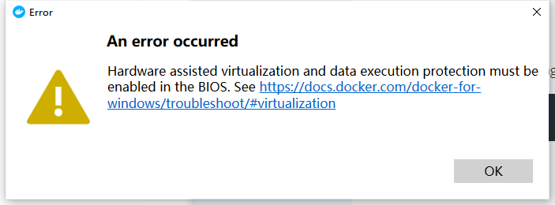

BlueStacks 是一个超强的安卓模拟器，由于最近有需求所以安装了一个 BlueStacks。但是在遇到了一系列问题后我决定卸载，然而因此我又遇到了一系列问题......

<!--more-->

## 为什么我要卸载 BlueStacks？

因为他不和 HyperV 兼容，虽然 BlueStacks5 兼容，但是他不能打开 Root，所以我把他卸载了。

虽然 BlueStacks4 有 HyperV 兼容版本，但是几乎随时都在崩溃，所以也抛弃了。

在我安装完毕 BlueStacks5 后我发现我的 Docker 服务启动失败，仔细一想应该是 HyperV 被 BlueStacks5 的引擎占用了所以*没有在意*，在卸载 BlueStacks5 后甚至以为*重启一下*就行，但是我错了，**错的还非常严重**。

**噩梦就此开始。**

## 噩梦

首先我的 Docker 服务启动失败了,



然后我的 WSL2 无法启动


随后我检查了我的系统功能配置


检查了我的虚拟化配置


他们都是正常的

重新打开关闭了他们，重启后依然遇到了这些问题，完全无法解决

非常绝望，在这个时候甚至想`重装` Windows，但是综合考虑到代价又感觉似乎太重了，还是搁置等某一天能自动解决这个问题

直到我脑子一闪想到了在 Docker 不支持 WSL2 后端时候打开 HTTP API 的方法：通过 socket 工具把数据暴露出来

或许 Docker 现在用了 WSL2 后端也依赖 socket？而且 HyperV 内的 WSL2 和外界通信也需要使用 socket？

Windows 不是 UNIX-like 系统，早就去掉了 POSIX 子系统，所以 Windows 内多半有一个 socket 管理器，那么 Windows 内部的 socket 管理器是不是被 BlueStacks 改过？

## 醒梦

经过资料的查询，果然 Windows 内部为了支持 UNIX 的 Socket 和一系列其他网络协议做了 winsock，但是没有查找到相应的 BlueStack 会修改 winsock 的资料

然而我查到了 winsock 会导致 WSL2 无法工作的 issue

当然 WSL2 无法工作意味着 Docker 也无法工作

[Winsock module breaks WSL2](https://github.com/microsoft/wsl/issues/4177)

经过推测，没办法得出结论，只能死马当活马医了

在这个 issue 里面我发现了这么[一条](https://github.com/microsoft/wsl/issues/4177#issuecomment-635924671)

> i cannot use WSL 2 and proxifier at the same time,
> netsh winsock reset
> will fix it temporarily.

同时在这里有一个[跳转](https://github.com/docker/for-win/issues/7164)，跳转到 Docker 的项目，在这里它提到了一条很重要的信息

> there was a bug with microsoft/WSL#4177

想必就是 WSL2 的问题了，我回去继续看解决方法。

但是 issue 中其他回复对我是无用的，所以我只找到了这一条大概是有效的命令

```pwsh
netsh winsock reset
```

字面上看，重置 netsh 服务当中的 winsock。

事实证明它成功了，我的 WSL2 又活了过来，Docker 也正常工作了

## 总结

虽然搞的莫名其妙，噩梦的非常莫名其妙，修好系统也是莫名其妙，但是总归是修好了。

还好有一点 Docker 可能和 socket 相关的记忆，让我想到了 Docker 启动失败是否和 socket 有关，抓住了一点点线索完成了修复

另外现在好像也没有 HyperV 兼容的安卓模拟器，真难过
